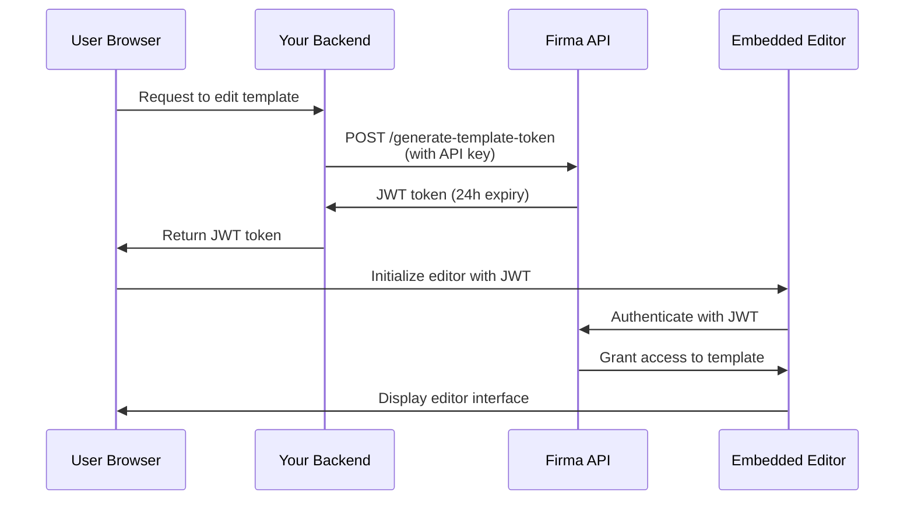

# API-Authentifizierung & JWT-Tokens

Die Firma-API verwendet zwei Authentifizierungsmethoden: API-Key-Authentifizierung für Server-zu-Server-Anfragen und JWT-Tokens zum Einbetten der Template- und Signaturanfragen-Editoren in Ihre Anwendung.

## API-Key-Authentifizierung

Alle API-Endpunkte erfordern eine Authentifizierung mit einem API-Schlüssel im `Authorization`-Header.

### Funktionsweise

Ihr API-Schlüssel authentifiziert Ihre Anfragen und legt fest, auf welche Workspace-Ressourcen Sie zugreifen können. Jeder Workspace hat einen eigenen, eindeutigen API-Schlüssel, den Sie über den Endpunkt [Get Workspace](/api-reference/v01.15.00/workspaces/get-a-workspace) abrufen können.

**Geschützter Workspace**: Jedes Firmen-Konto verfügt über einen geschützten Workspace, der nicht gelöscht werden kann. Dieser geschützte Workspace enthält den Haupt-API-Schlüssel für Ihr Konto, der Zugriff auf alle Endpunkte für Workspaces, API-Schlüssel, Firma/Konto und Webhooks hat. Verwenden Sie diesen Schlüssel für kontoweite Operationen oder wenn Sie mehrere Workspaces verwalten müssen.

### Testmodus (Live- vs. Test-Schlüssel)

Jeder Workspace hat **zwei** API-Schlüssel: einen **Live**-Schlüssel und einen **Test**-Schlüssel. Der Testmodus wird dadurch bestimmt, welchen Schlüssel Sie senden – es gibt kein separates Flag oder Parameter.

- Anfragen, die mit dem **Test**-Schlüssel authentifiziert werden, verbrauchen **keine** Credits, und alle damit erstellten Signaturanfragen werden als Test markiert und mit einem Wasserzeichen versehen.
- Anfragen, die mit dem **Live**-Schlüssel authentifiziert werden, laufen normal und verbrauchen Credits.

Beide Schlüssel werden beim Erstellen eines Workspaces zurückgegeben (`api_key` = live, `test_api_key` = test) sowie von den Endpunkten [Get Workspace](/api-reference/v01.24.00/workspaces/get-a-workspace) und List Workspaces. Verwenden Sie den Test-Schlüssel während der Integration und wechseln Sie dann für die Produktion zum Live-Schlüssel.

Sie können jeden Schlüsseltyp unabhängig rotieren: Übergeben Sie `key_type` (`"live"` oder `"test"`, Standard `"live"`) an die Endpunkte [regenerate](/api-reference/v01.24.00/workspaces/regenerate-workspace-api-key) und [expire](/api-reference/v01.24.00/workspaces/expire-pending-api-keys). Das Rotieren eines Typs wirkt sich nicht auf den anderen aus.

<Note>
  Test-Schlüssel sind vollwertige Anmeldeinformationen mit demselben Zugriffsumfang wie Live-Schlüssel – bewahren Sie sie serverseitig auf und legen Sie sie niemals im Client-Code offen. Der einzige Unterschied liegt im Abrechnungs- und Wasserzeichen-Verhalten.
</Note>

### API-Key-Rotation

Sie können API-Schlüssel für nicht geschützte Workspaces regenerieren, um die Sicherheit zu erhöhen. Beim Regenerieren eines Schlüssels:

1. **Ein neuer API-Schlüssel wird sofort erstellt** und in der Antwort zurückgegeben
2. **Alte Schlüssel werden auf Ablauf in 24 Stunden gesetzt** – sie funktionieren während dieser Übergangsphase weiter
3. **Sie können alte Schlüssel manuell frühzeitig ablaufen lassen**, sobald Sie überprüft haben, dass der neue Schlüssel funktioniert

<Note>
  **Schlüssel geschützter Workspaces können nicht** über die API regeneriert werden. Dies verhindert versehentliches Aussperren aus Ihrem Konto. Wenden Sie sich an den Support, wenn Sie Ihren geschützten Workspace-Schlüssel rotieren möchten.
</Note>

#### API-Schlüssel regenerieren

Generieren Sie einen neuen API-Schlüssel für einen Workspace. Der alte Schlüssel läuft automatisch nach 24 Stunden ab:

```javascript
const response = await fetch(
  `https://api.firma.dev/functions/v1/signing-request-api/workspaces/${workspaceId}/api-key/regenerate`,
  {
    method: 'POST',
    headers: {
      'Authorization': process.env.FIRMA_API_KEY,
      'Content-Type': 'application/json'
    }
  }
);

const result = await response.json();
console.log('New API key:', result.new_key);
// Store the new key securely
```

**Antwort:**

```json
{
  "message": "API key regenerated. Old keys will expire in 24 hours.",
  "workspace_id": "123e4567-e89b-12d3-a456-426614174000",
  "new_key": "firma_api_abc123xyz...",
  "expiring_keys": [
    {
      "id": "old-key-uuid",
      "expires_at": "2025-12-19T10:30:00Z"
    }
  ]
}
```

#### Alte Schlüssel frühzeitig ablaufen lassen

Nachdem Sie überprüft haben, dass Ihr neuer Schlüssel funktioniert, können Sie alle ausstehenden Schlüssel sofort ablaufen lassen:

```javascript
const response = await fetch(
  `https://api.firma.dev/functions/v1/signing-request-api/workspaces/${workspaceId}/api-key/expire`,
  {
    method: 'POST',
    headers: {
      'Authorization': process.env.FIRMA_API_KEY,
      'Content-Type': 'application/json'
    }
  }
);

const result = await response.json();
console.log(`Expired ${result.expired_count} key(s)`);
```

**Antwort:**

```json
{
  "message": "Expired 1 pending API key(s)",
  "workspace_id": "123e4567-e89b-12d3-a456-426614174000",
  "expired_count": 1,
  "expired_keys": ["old-key-uuid"]
}
```

**Best Practice für die Schlüsselrotation:**

1. Rufen Sie den Regenerate-Endpunkt auf, um einen neuen Schlüssel zu erhalten
2. Aktualisieren Sie Ihre Anwendungskonfiguration mit dem neuen Schlüssel
3. Testen Sie, ob der neue Schlüssel korrekt funktioniert
4. Rufen Sie den Expire-Endpunkt auf, um alte Schlüssel sofort ungültig zu machen
5. Achten Sie auf Fehler, die darauf hindeuten, dass Dienste noch den alten Schlüssel verwenden

<Warning>
  **Legen Sie Ihren API-Schlüssel niemals in Frontend-Code oder clientseitigen Anwendungen offen.** API-Schlüssel sollten nur in sicheren Backend-Diensten verwendet werden. Speichern Sie sie stets als Umgebungsvariablen.
</Warning>

### Header-Format

Der API-Schlüssel kann auf zwei Arten übermittelt werden:

1. **Direktes Format** (empfohlen wegen Einfachheit):

```bash
Authorization: your-api-key-here
```

2. **Bearer-Token-Format** (optional):

```bash
Authorization: Bearer your-api-key-here
```

Beide Formate werden akzeptiert. Der Bearer-Präfix ist optional und nicht erforderlich.

### Codebeispiele

<CodeGroup>

```bash cURL
curl https://api.firma.dev/functions/v1/signing-request-api/templates \
  -H "Authorization: YOUR_API_KEY" \
  -H "Content-Type: application/json"
```


```javascript JavaScript
const response = await fetch(
  'https://api.firma.dev/functions/v1/signing-request-api/templates',
  {
    headers: {
      'Authorization': process.env.FIRMA_API_KEY,
      'Content-Type': 'application/json'
    }
  }
);

const templates = await response.json();
```


```python Python
import os
import requests

headers = {
    'Authorization': os.environ['FIRMA_API_KEY'],
    'Content-Type': 'application/json'
}

response = requests.get(
    'https://api.firma.dev/functions/v1/signing-request-api/templates',
    headers=headers
)

templates = response.json()
```

</CodeGroup>

### Fehlerantwort

Wenn Ihr API-Schlüssel fehlt oder ungültig ist, erhalten Sie eine `401 Unauthorized`-Antwort:

```json
{
  "error": "Unauthorized",
  "code": "UNAUTHORIZED",
  "message": "Invalid or missing API key"
}
```

---

## JWT-Tokens für eingebettete Funktionen

JWT-Tokens (JSON Web Token) ermöglichen es Ihnen, den Template-Editor und den Signaturanfragen-Editor von Firma direkt in Ihre Anwendung einzubetten. Diese Tokens sind RSA-256-signiert und zeitlich begrenzt, um Sicherheit zu gewährleisten.

### Wann Sie JWT-Tokens verwenden sollten

Verwenden Sie JWT-Tokens, wenn Sie:

- Den Template-Editor in Ihre Anwendung einbetten möchten, damit Benutzer Dokumentvorlagen erstellen/bearbeiten können
- Den Signaturanfragen-Editor einbetten möchten, damit Benutzer Dokumente vor dem Versand anpassen können
- Sicheren, zeitlich begrenzten Zugriff auf bestimmte Templates oder Signaturanfragen bereitstellen möchten
- Steuern möchten, auf welche Ressourcen Benutzer zugreifen können, ohne Ihren API-Schlüssel offenzulegen

<Note>
  **JWT-Tokens sollten immer aus Ihrem sicheren Backend generiert werden**, niemals aus Frontend-Code. Ihr Backend verwendet den API-Schlüssel, um Tokens zu erzeugen, die dann zur Editor-Initialisierung an das Frontend übergeben werden.
</Note>

### JWT-Token-Typen

| Token-Typ                    | Endpunkt                                                                                                                         | Ablauf     | Anwendungsfall                                                    |
| ---------------------------- | -------------------------------------------------------------------------------------------------------------------------------- | ---------- | ----------------------------------------------------------------- |
| **Template-Token**           | [Generate JWT Token for Embedding Templates](/api-reference/v01.15.00/jwt-management/generate-jwt-token-for-embedding-templates) | 24 Stunden | Template-Editor zum Erstellen/Bearbeiten von Templates einbetten  |
| **Signaturanfragen-Token**   | [Generate JWT Token for Signing Request](/api-reference/v01.15.00/jwt-management/generate-jwt-token-for-signing-request)         | 24 Stunden | Signaturanfragen-Editor zur Dokumentanpassung einbetten           |

### Authentifizierungsablauf

So funktioniert die JWT-Authentifizierung für eingebettete Funktionen:



### Implementierungsleitfaden

#### Schritt 1: JWT-Token generieren (Backend)

Generieren Sie ein JWT-Token aus Ihrem sicheren Backend mit Ihrem API-Schlüssel:

<CodeGroup>

```javascript Node.js/Express
// Backend endpoint to generate JWT for template editing
app.post('/api/get-template-token', async (req, res) => {
  const { templateId } = req.body;

  try {
    const response = await fetch(
      'https://api.firma.dev/functions/v1/signing-request-api/generate-template-token',
      {
        method: 'POST',
        headers: {
          'Authorization': process.env.FIRMA_API_KEY,
          'Content-Type': 'application/json'
        },
        body: JSON.stringify({
          companies_workspaces_templates_id: templateId
        })
      }
    );

    const data = await response.json();
    
    // Return JWT to frontend (never expose API key)
    res.json({ 
      token: data.jwt,
      expiresAt: data.expires_at 
    });
  } catch (error) {
    res.status(500).json({ error: 'Failed to generate token' });
  }
});
```


```python Python/Flask
from flask import Flask, request, jsonify
import os
import requests

app = Flask(__name__)

@app.route('/api/get-template-token', methods=['POST'])
def get_template_token():
    template_id = request.json.get('templateId')
    
    try:
        response = requests.post(
            'https://api.firma.dev/functions/v1/signing-request-api/generate-template-token',
            headers={
                'Authorization': os.environ['FIRMA_API_KEY'],
                'Content-Type': 'application/json'
            },
            json={
                'companies_workspaces_templates_id': template_id
            }
        )
        
        data = response.json()
        
        # Return JWT to frontend (never expose API key)
        return jsonify({
            'token': data['jwt'],
            'expiresAt': data['expires_at']
        })
    except Exception as e:
        return jsonify({'error': 'Failed to generate token'}), 500
```

</CodeGroup>

**Antwort:**

```json
{
  "jwt": "eyJhbGciOiJSUzI1NiIsInR5cCI6IkpXVCJ9...",
  "jwt_id": "a1b2c3d4-e5f6-7g8h-9i0j-k1l2m3n4o5p6",
  "expires_at": "2025-12-18T10:00:00Z",
  "template_id": "template-uuid-here"
}
```

#### Schritt 2: Editor initialisieren (Frontend)

Verwenden Sie das JWT-Token, um den eingebetteten Editor in Ihrem Frontend zu initialisieren:

```html
<!DOCTYPE html>
<html>
<head>
  <title>Template Editor</title>
  <!-- Load the Firma Template Editor library -->
  <script src="https://api.firma.dev/functions/v1/embed-proxy/template-editor.js"></script>
</head>
<body>
  <div id="firma-editor-container" style="width: 100%; height: 600px;"></div>

  <script>
    async function initializeEditor(templateId) {
      // Request JWT from your backend
      const response = await fetch('/api/get-template-token', {
        method: 'POST',
        headers: { 'Content-Type': 'application/json' },
        body: JSON.stringify({ templateId })
      });

      const { token, expiresAt } = await response.json();

      // Initialize the embedded editor
      window.FirmaTemplateEditor.init({
        container: '#firma-editor-container',
        jwt: token,
        templateId: templateId,
        theme: 'light', // or 'dark'
        readOnly: false,
        onSave: (savedData) => {
          console.log('Template saved successfully:', savedData);
        },
        onError: (error) => {
          console.error('Editor error:', error);
        },
        onLoad: (template) => {
          console.log('Template loaded:', template);
        }
      });
    }

    // Initialize with your template ID
    initializeEditor('your-template-id-here');
  </script>
</body>
</html>
```

Für den Signaturanfragen-Editor verwenden Sie den JWT-Endpunkt für Signaturanfragen und die Bibliothek des Signaturanfragen-Editors:

```javascript
// Generate signing request token from backend
const response = await fetch('/api/get-signing-request-token', {
  method: 'POST',
  headers: { 'Content-Type': 'application/json' },
  body: JSON.stringify({ signingRequestId })
});

const { token } = await response.json();

// Load signing request editor library
// <script src="https://api.firma.dev/functions/v1/embed-proxy/signing-request-editor.js"></script>

// Initialize signing request editor
window.FirmaSigningRequestEditor.init({
  container: '#firma-signing-request-container',
  jwt: token,
  signingRequestId: signingRequestId,
  theme: 'light',
  onSave: (data) => console.log('Signing request saved:', data),
  onSend: (data) => console.log('Signing request sent:', data),
  onError: (error) => console.error('Error:', error)
});
```

#### Schritt 3: JWT-Token widerrufen (optional)

Widerrufen Sie ein JWT-Token, wenn es nicht mehr benötigt wird:

<CodeGroup>

```javascript Node.js
const response = await fetch(
  'https://api.firma.dev/functions/v1/signing-request-api/revoke-template-token',
  {
    method: 'POST',
    headers: {
      'Authorization': process.env.FIRMA_API_KEY,
      'Content-Type': 'application/json'
    },
    body: JSON.stringify({
      jwt_id: 'a1b2c3d4-e5f6-7g8h-9i0j-k1l2m3n4o5p6'
    })
  }
);

const result = await response.json();
// { message: "JWT revoked successfully", jwt_id: "...", revoked_at: "..." }
```


```python Python
response = requests.post(
    'https://api.firma.dev/functions/v1/signing-request-api/revoke-template-token',
    headers={
        'Authorization': os.environ['FIRMA_API_KEY'],
        'Content-Type': 'application/json'
    },
    json={
        'jwt_id': 'a1b2c3d4-e5f6-7g8h-9i0j-k1l2m3n4o5p6'
    }
)

result = response.json()
```

</CodeGroup>

### Best Practices für die JWT-Sicherheit

<Warning>
  **Sicherheits-Checkliste:**

  1. ✅ **Generieren Sie JWTs immer aus Ihrem Backend** – Legen Sie Ihren API-Schlüssel niemals im Frontend-Code offen
  2. ✅ **Verwenden Sie Umgebungsvariablen** – Speichern Sie API-Schlüssel sicher, kodieren Sie sie niemals fest
  3. ✅ **Validieren Sie den Token-Ablauf** – Prüfen Sie `expires_at` und aktualisieren Sie Tokens nach Bedarf
  4. ✅ **Verwenden Sie ausschließlich HTTPS** – Übertragen Sie Tokens niemals über unverschlüsselte Verbindungen
  5. ✅ **Widerrufen Sie ungenutzte Tokens** – Widerrufen Sie JWTs, wenn die Bearbeitung abgeschlossen ist oder die Sitzung endet
  6. ✅ **Implementieren Sie Token-Refresh** – Fordern Sie für laufende Sitzungen vor Ablauf neue Tokens an
  7. ✅ **Legen Sie den Token-Geltungsbereich passend fest** – Jedes JWT ist an ein bestimmtes Template oder eine Signaturanfrage gebunden
</Warning>

---

## 

---

## Verwandte Leitfäden

Erfahren Sie mehr über die Implementierung eingebetteter Funktionen und die Arbeit mit der API:

- [Einbettbarer Template-Editor](/guides/embeddable-template-editor) – Vollständiger Leitfaden zum Einbetten des Template-Editors
- [Einbettbarer Signaturanfragen-Editor](/guides/embeddable-signing-request-editor) – Signaturanfragen-Anpassung einbetten
- [Signaturanfragen senden](/guides/sending-signing-request) – Dokumente zur Signatur senden
- [Webhooks](/guides/webhooks) – Echtzeit-Ereignisse abonnieren

## API-Referenz

Wichtige Endpunkte für Authentifizierung und JWT-Verwaltung:

**API-Schlüsselverwaltung:**

- [Get Workspace](/api-reference/v01.15.00/workspaces/get-a-workspace) – Workspace-API-Schlüssel abrufen
- [Regenerate Workspace API Key](/api-reference/v01.15.00/workspaces/regenerate-workspace-api-key) – Neuen API-Schlüssel generieren
- [Expire Pending API Keys](/api-reference/v01.15.00/workspaces/expire-pending-api-keys) – Alte Schlüssel sofort ablaufen lassen

**JWT-Token-Verwaltung:**

- [Generate JWT Token for Embedding Templates](/api-reference/v01.15.00/jwt-management/generate-jwt-token-for-embedding-templates)
- [Generate JWT Token for Signing Request](/api-reference/v01.15.00/jwt-management/generate-jwt-token-for-signing-request)
- [Revoke Template JWT Token](/api-reference/v01.15.00/jwt-management/revoke-template-jwt-token)
- [Revoke Signing Request JWT Token](/api-reference/v01.15.00/jwt-management/revoke-a-signing-request-jwt-token)

**Erste Schritte:**

- [Get Company Information](/api-reference/v01.15.00/company/get-company-information)
- [Create Template](/api-reference/v01.15.00/templates/create-template)
- [Create Signing Request](/api-reference/v01.15.00/signing-requests/create-signing-request)
