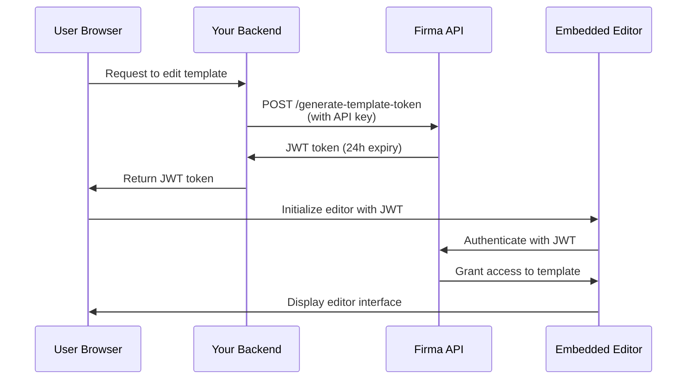

# Autenticación de la API y tokens JWT

La API de Firma utiliza dos métodos de autenticación: autenticación con clave de API para las solicitudes de servidor a servidor y tokens JWT para integrar los editores de plantillas y de solicitudes de firma en tu aplicación.

## Autenticación con clave de API

Todos los endpoints de la API requieren autenticación utilizando una clave de API en el encabezado `Authorization`.

### Cómo funciona

Tu clave de API autentica tus solicitudes y determina a qué recursos de espacio de trabajo puedes acceder. Cada espacio de trabajo tiene su propia clave de API única, que puedes obtener a través del endpoint [Get Workspace](/api-reference/v01.15.00/workspaces/get-a-workspace).

**Espacio de trabajo protegido**: cada cuenta de empresa tiene un espacio de trabajo protegido que no se puede eliminar. Este espacio de trabajo protegido contiene la clave de API principal de tu cuenta, que tiene acceso a todos los endpoints de espacio de trabajo, clave de API, empresa/cuenta y webhooks. Usa esta clave para operaciones de toda la cuenta o cuando necesites gestionar varios espacios de trabajo.

### Modo de prueba (claves en vivo frente a claves de prueba)

Cada espacio de trabajo tiene **dos** claves de API: una clave **en vivo** y una clave **de prueba**. El modo de prueba se determina según la clave que envíes; no hay un indicador o parámetro separado.

- Las solicitudes autenticadas con la clave **de prueba** **no** consumen créditos, y cualquier solicitud de firma que creen se marca como de prueba y lleva marca de agua.
- Las solicitudes autenticadas con la clave **en vivo** se ejecutan con normalidad y consumen créditos.

Ambas claves se devuelven al crear un espacio de trabajo (`api_key` = en vivo, `test_api_key` = de prueba) y en los endpoints [Get Workspace](/api-reference/v01.24.00/workspaces/get-a-workspace) y List Workspaces. Usa la clave de prueba mientras integras y, después, cambia a la clave en vivo para producción.

Puedes rotar cada tipo de clave de forma independiente: pasa `key_type` (`"live"` o `"test"`, predeterminado `"live"`) a los endpoints [regenerate](/api-reference/v01.24.00/workspaces/regenerate-workspace-api-key) y [expire](/api-reference/v01.24.00/workspaces/expire-pending-api-keys). Rotar un tipo no afecta al otro.

<Note>
  Las claves de prueba son credenciales completas con el mismo alcance de acceso que las claves en vivo: mantenlas en el servidor y no las expongas nunca en el código del cliente. La única diferencia es el comportamiento de facturación y de marca de agua.
</Note>

### Rotación de claves de API

Puedes regenerar las claves de API para espacios de trabajo no protegidos con el fin de mejorar la seguridad. Cuando regeneras una clave:

1. **Se crea una nueva clave de API inmediatamente** y se devuelve en la respuesta
2. **Las claves antiguas se configuran para expirar en 24 horas**: siguen funcionando durante este periodo de gracia
3. **Puedes expirar manualmente las claves antiguas antes** una vez que hayas verificado que la nueva clave funciona

<Note>
  **Las claves de espacios de trabajo protegidos no pueden regenerarse** a través de la API. Esto evita bloqueos accidentales de tu cuenta. Contacta con soporte si necesitas rotar la clave de tu espacio de trabajo protegido.
</Note>

#### Regenerar clave de API

Genera una nueva clave de API para un espacio de trabajo. La clave antigua expirará automáticamente después de 24 horas:

```javascript
const response = await fetch(
  `https://api.firma.dev/functions/v1/signing-request-api/workspaces/${workspaceId}/api-key/regenerate`,
  {
    method: 'POST',
    headers: {
      'Authorization': process.env.FIRMA_API_KEY,
      'Content-Type': 'application/json'
    }
  }
);

const result = await response.json();
console.log('New API key:', result.new_key);
// Store the new key securely
```

**Respuesta:**

```json
{
  "message": "API key regenerated. Old keys will expire in 24 hours.",
  "workspace_id": "123e4567-e89b-12d3-a456-426614174000",
  "new_key": "firma_api_abc123xyz...",
  "expiring_keys": [
    {
      "id": "old-key-uuid",
      "expires_at": "2025-12-19T10:30:00Z"
    }
  ]
}
```

#### Expirar las claves antiguas antes

Después de verificar que tu nueva clave funciona, puedes expirar inmediatamente todas las claves pendientes:

```javascript
const response = await fetch(
  `https://api.firma.dev/functions/v1/signing-request-api/workspaces/${workspaceId}/api-key/expire`,
  {
    method: 'POST',
    headers: {
      'Authorization': process.env.FIRMA_API_KEY,
      'Content-Type': 'application/json'
    }
  }
);

const result = await response.json();
console.log(`Expired ${result.expired_count} key(s)`);
```

**Respuesta:**

```json
{
  "message": "Expired 1 pending API key(s)",
  "workspace_id": "123e4567-e89b-12d3-a456-426614174000",
  "expired_count": 1,
  "expired_keys": ["old-key-uuid"]
}
```

**Mejores prácticas para la rotación de claves:**

1. Llama al endpoint de regeneración para obtener una nueva clave
2. Actualiza la configuración de tu aplicación con la nueva clave
3. Prueba que la nueva clave funcione correctamente
4. Llama al endpoint de expiración para invalidar inmediatamente las claves antiguas
5. Monitoriza si hay errores que indiquen que algún servicio sigue usando la clave antigua

<Warning>
  **Nunca expongas tu clave de API en código de frontend o aplicaciones del lado del cliente.** Las claves de API solo deben usarse en servicios de backend seguros. Guárdalas siempre como variables de entorno.
</Warning>

### Formato del encabezado

La clave de API se puede enviar de dos formas:

1. **Formato directo** (recomendado por su simplicidad):

```bash
Authorization: your-api-key-here
```

2. **Formato de token Bearer** (opcional):

```bash
Authorization: Bearer your-api-key-here
```

Se aceptan ambos formatos. El prefijo Bearer es opcional y no obligatorio.

### Ejemplos de código

<CodeGroup>

```bash cURL
curl https://api.firma.dev/functions/v1/signing-request-api/templates \
  -H "Authorization: YOUR_API_KEY" \
  -H "Content-Type: application/json"
```


```javascript JavaScript
const response = await fetch(
  'https://api.firma.dev/functions/v1/signing-request-api/templates',
  {
    headers: {
      'Authorization': process.env.FIRMA_API_KEY,
      'Content-Type': 'application/json'
    }
  }
);

const templates = await response.json();
```


```python Python
import os
import requests

headers = {
    'Authorization': os.environ['FIRMA_API_KEY'],
    'Content-Type': 'application/json'
}

response = requests.get(
    'https://api.firma.dev/functions/v1/signing-request-api/templates',
    headers=headers
)

templates = response.json()
```

</CodeGroup>

### Respuesta de error

Si tu clave de API falta o no es válida, recibirás una respuesta `401 Unauthorized`:

```json
{
  "error": "Unauthorized",
  "code": "UNAUTHORIZED",
  "message": "Invalid or missing API key"
}
```

---

## Tokens JWT para funciones integradas

Los tokens JWT (JSON Web Token) te permiten integrar el editor de plantillas y el editor de solicitudes de firma de Firma directamente en tu aplicación. Estos tokens están firmados con RSA-256 y tienen un límite de tiempo por seguridad.

### Cuándo usar tokens JWT

Utiliza tokens JWT cuando quieras:

- Integrar el editor de plantillas en tu aplicación para que los usuarios creen/editen plantillas de documentos
- Integrar el editor de solicitudes de firma para que los usuarios personalicen documentos antes de enviarlos
- Proporcionar acceso seguro y con límite de tiempo a plantillas o solicitudes de firma específicas
- Controlar a qué recursos pueden acceder los usuarios sin exponer tu clave de API

<Note>
  **Los tokens JWT deben generarse siempre desde tu backend seguro**, nunca desde el código del frontend. Tu backend utiliza la clave de API para generar tokens, que luego se pasan al frontend para inicializar el editor.
</Note>

### Tipos de token JWT

| Tipo de token                | Endpoint                                                                                                                         | Expiración | Caso de uso                                                |
| ---------------------------- | -------------------------------------------------------------------------------------------------------------------------------- | ---------- | ---------------------------------------------------------- |
| **Token de plantilla**       | [Generate JWT Token for Embedding Templates](/api-reference/v01.15.00/jwt-management/generate-jwt-token-for-embedding-templates) | 24 horas   | Integra el editor de plantillas para crear/editar plantillas |
| **Token de solicitud de firma** | [Generate JWT Token for Signing Request](/api-reference/v01.15.00/jwt-management/generate-jwt-token-for-signing-request)         | 24 horas   | Integra el editor de solicitudes de firma para personalizar documentos |

### Flujo de autenticación

Así funciona la autenticación JWT para las funciones integradas:



### Guía de implementación

#### Paso 1: generar el token JWT (backend)

Genera un token JWT desde tu backend seguro usando tu clave de API:

<CodeGroup>

```javascript Node.js/Express
// Backend endpoint to generate JWT for template editing
app.post('/api/get-template-token', async (req, res) => {
  const { templateId } = req.body;

  try {
    const response = await fetch(
      'https://api.firma.dev/functions/v1/signing-request-api/generate-template-token',
      {
        method: 'POST',
        headers: {
          'Authorization': process.env.FIRMA_API_KEY,
          'Content-Type': 'application/json'
        },
        body: JSON.stringify({
          companies_workspaces_templates_id: templateId
        })
      }
    );

    const data = await response.json();
    
    // Return JWT to frontend (never expose API key)
    res.json({ 
      token: data.jwt,
      expiresAt: data.expires_at 
    });
  } catch (error) {
    res.status(500).json({ error: 'Failed to generate token' });
  }
});
```


```python Python/Flask
from flask import Flask, request, jsonify
import os
import requests

app = Flask(__name__)

@app.route('/api/get-template-token', methods=['POST'])
def get_template_token():
    template_id = request.json.get('templateId')
    
    try:
        response = requests.post(
            'https://api.firma.dev/functions/v1/signing-request-api/generate-template-token',
            headers={
                'Authorization': os.environ['FIRMA_API_KEY'],
                'Content-Type': 'application/json'
            },
            json={
                'companies_workspaces_templates_id': template_id
            }
        )
        
        data = response.json()
        
        # Return JWT to frontend (never expose API key)
        return jsonify({
            'token': data['jwt'],
            'expiresAt': data['expires_at']
        })
    except Exception as e:
        return jsonify({'error': 'Failed to generate token'}), 500
```

</CodeGroup>

**Respuesta:**

```json
{
  "jwt": "eyJhbGciOiJSUzI1NiIsInR5cCI6IkpXVCJ9...",
  "jwt_id": "a1b2c3d4-e5f6-7g8h-9i0j-k1l2m3n4o5p6",
  "expires_at": "2025-12-18T10:00:00Z",
  "template_id": "template-uuid-here"
}
```

#### Paso 2: inicializar el editor (frontend)

Utiliza el token JWT para inicializar el editor integrado en tu frontend:

```html
<!DOCTYPE html>
<html>
<head>
  <title>Template Editor</title>
  <!-- Load the Firma Template Editor library -->
  <script src="https://api.firma.dev/functions/v1/embed-proxy/template-editor.js"></script>
</head>
<body>
  <div id="firma-editor-container" style="width: 100%; height: 600px;"></div>

  <script>
    async function initializeEditor(templateId) {
      // Request JWT from your backend
      const response = await fetch('/api/get-template-token', {
        method: 'POST',
        headers: { 'Content-Type': 'application/json' },
        body: JSON.stringify({ templateId })
      });

      const { token, expiresAt } = await response.json();

      // Initialize the embedded editor
      window.FirmaTemplateEditor.init({
        container: '#firma-editor-container',
        jwt: token,
        templateId: templateId,
        theme: 'light', // or 'dark'
        readOnly: false,
        onSave: (savedData) => {
          console.log('Template saved successfully:', savedData);
        },
        onError: (error) => {
          console.error('Editor error:', error);
        },
        onLoad: (template) => {
          console.log('Template loaded:', template);
        }
      });
    }

    // Initialize with your template ID
    initializeEditor('your-template-id-here');
  </script>
</body>
</html>
```

Para el editor de solicitudes de firma, usa el endpoint JWT de solicitud de firma y la librería del editor de solicitudes de firma:

```javascript
// Generate signing request token from backend
const response = await fetch('/api/get-signing-request-token', {
  method: 'POST',
  headers: { 'Content-Type': 'application/json' },
  body: JSON.stringify({ signingRequestId })
});

const { token } = await response.json();

// Load signing request editor library
// <script src="https://api.firma.dev/functions/v1/embed-proxy/signing-request-editor.js"></script>

// Initialize signing request editor
window.FirmaSigningRequestEditor.init({
  container: '#firma-signing-request-container',
  jwt: token,
  signingRequestId: signingRequestId,
  theme: 'light',
  onSave: (data) => console.log('Signing request saved:', data),
  onSend: (data) => console.log('Signing request sent:', data),
  onError: (error) => console.error('Error:', error)
});
```

#### Paso 3: revocar el token JWT (opcional)

Revoca un token JWT cuando ya no sea necesario:

<CodeGroup>

```javascript Node.js
const response = await fetch(
  'https://api.firma.dev/functions/v1/signing-request-api/revoke-template-token',
  {
    method: 'POST',
    headers: {
      'Authorization': process.env.FIRMA_API_KEY,
      'Content-Type': 'application/json'
    },
    body: JSON.stringify({
      jwt_id: 'a1b2c3d4-e5f6-7g8h-9i0j-k1l2m3n4o5p6'
    })
  }
);

const result = await response.json();
// { message: "JWT revoked successfully", jwt_id: "...", revoked_at: "..." }
```


```python Python
response = requests.post(
    'https://api.firma.dev/functions/v1/signing-request-api/revoke-template-token',
    headers={
        'Authorization': os.environ['FIRMA_API_KEY'],
        'Content-Type': 'application/json'
    },
    json={
        'jwt_id': 'a1b2c3d4-e5f6-7g8h-9i0j-k1l2m3n4o5p6'
    }
)

result = response.json()
```

</CodeGroup>

### Mejores prácticas de seguridad para JWT

<Warning>
  **Lista de comprobación de seguridad:**

  1. ✅ **Genera siempre los JWT desde tu backend**: no expongas nunca tu clave de API en el código del frontend
  2. ✅ **Utiliza variables de entorno**: almacena las claves de API de forma segura, nunca las codifiques directamente
  3. ✅ **Valida la expiración del token**: comprueba `expires_at` y refresca los tokens según sea necesario
  4. ✅ **Utiliza solo HTTPS**: nunca transmitas tokens por conexiones sin cifrar
  5. ✅ **Revoca los tokens no utilizados**: revoca los JWT cuando termine la edición o finalice la sesión
  6. ✅ **Implementa el refresco de tokens**: solicita nuevos tokens antes de la expiración para las sesiones en curso
  7. ✅ **Ajusta el ámbito de los tokens apropiadamente**: cada JWT está vinculado a una plantilla o solicitud de firma específica
</Warning>

---

## 

---

## Guías relacionadas

Obtén más información sobre la implementación de funciones integradas y el trabajo con la API:

- [Editor de plantillas integrable](/guides/embeddable-template-editor): guía completa para integrar el editor de plantillas
- [Editor de solicitudes de firma integrable](/guides/embeddable-signing-request-editor): integra la personalización de solicitudes de firma
- [Envío de solicitudes de firma](/guides/sending-signing-request): envía documentos para firma
- [Webhooks](/guides/webhooks): suscríbete a eventos en tiempo real

## Referencia de la API

Endpoints clave de autenticación y gestión de JWT:

**Gestión de claves de API:**

- [Get Workspace](/api-reference/v01.15.00/workspaces/get-a-workspace): obtiene la clave de API del espacio de trabajo
- [Regenerate Workspace API Key](/api-reference/v01.15.00/workspaces/regenerate-workspace-api-key): genera una nueva clave de API
- [Expire Pending API Keys](/api-reference/v01.15.00/workspaces/expire-pending-api-keys): expira inmediatamente las claves antiguas

**Gestión de tokens JWT:**

- [Generate JWT Token for Embedding Templates](/api-reference/v01.15.00/jwt-management/generate-jwt-token-for-embedding-templates)
- [Generate JWT Token for Signing Request](/api-reference/v01.15.00/jwt-management/generate-jwt-token-for-signing-request)
- [Revoke Template JWT Token](/api-reference/v01.15.00/jwt-management/revoke-template-jwt-token)
- [Revoke Signing Request JWT Token](/api-reference/v01.15.00/jwt-management/revoke-a-signing-request-jwt-token)

**Primeros pasos:**

- [Get Company Information](/api-reference/v01.15.00/company/get-company-information)
- [Create Template](/api-reference/v01.15.00/templates/create-template)
- [Create Signing Request](/api-reference/v01.15.00/signing-requests/create-signing-request)
