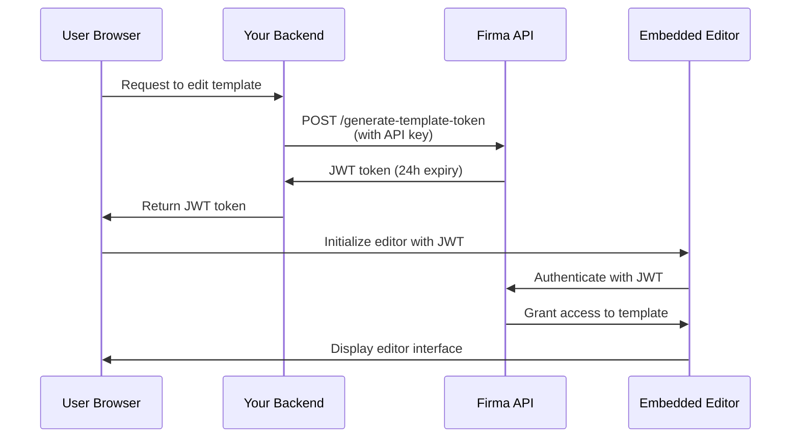

# Authentification API et jetons JWT

L'API Firma utilise deux méthodes d'authentification : l'authentification par clé API pour les requêtes serveur à serveur, et les jetons JWT pour intégrer les éditeurs de modèles et de demandes de signature dans votre application.

## Authentification par clé API

Tous les points de terminaison de l'API nécessitent une authentification à l'aide d'une clé API dans l'en-tête `Authorization`.

### Fonctionnement

Votre clé API authentifie vos requêtes et détermine à quelles ressources d'espace de travail vous pouvez accéder. Chaque espace de travail possède sa propre clé API unique, que vous pouvez récupérer via le point de terminaison [Get Workspace](/api-reference/v01.15.00/workspaces/get-a-workspace).

**Espace de travail protégé** : chaque compte d'entreprise dispose d'un espace de travail protégé qui ne peut pas être supprimé. Cet espace de travail protégé détient la clé API principale de votre compte, qui donne accès à tous les points de terminaison d'espace de travail, de clé API, d'entreprise/compte et de webhook. Utilisez cette clé pour les opérations à l'échelle du compte ou lorsque vous devez gérer plusieurs espaces de travail.

### Mode test (clés live et test)

Chaque espace de travail dispose de **deux** clés API : une clé **live** et une clé **test**. Le mode test est déterminé par la clé que vous envoyez ; il n'existe pas de drapeau ou de paramètre distinct.

- Les requêtes authentifiées avec la clé **test** ne consomment **pas** de crédits, et toute demande de signature qu'elles créent est marquée comme test et filigranée.
- Les requêtes authentifiées avec la clé **live** s'exécutent normalement et consomment des crédits.

Les deux clés sont renvoyées lors de la création d'un espace de travail (`api_key` = live, `test_api_key` = test) ainsi que par les points de terminaison [Get Workspace](/api-reference/v01.24.00/workspaces/get-a-workspace) et List Workspaces. Utilisez la clé test pendant l'intégration, puis passez à la clé live pour la production.

Vous pouvez faire pivoter chaque type de clé indépendamment : passez `key_type` (`"live"` ou `"test"`, valeur par défaut `"live"`) aux points de terminaison [regenerate](/api-reference/v01.24.00/workspaces/regenerate-workspace-api-key) et [expire](/api-reference/v01.24.00/workspaces/expire-pending-api-keys). La rotation d'un type n'affecte pas l'autre.

<Note>
  Les clés test sont des identifiants complets avec la même portée d'accès que les clés live ; conservez-les côté serveur et ne les exposez jamais dans le code client. La seule différence concerne la facturation et le comportement de filigrane.
</Note>

### Rotation des clés API

Vous pouvez régénérer les clés API des espaces de travail non protégés pour renforcer la sécurité. Lorsque vous régénérez une clé :

1. **Une nouvelle clé API est créée immédiatement** et renvoyée dans la réponse
2. **Les anciennes clés sont configurées pour expirer dans 24 heures** ; elles continuent de fonctionner pendant cette période de grâce
3. **Vous pouvez faire expirer manuellement les anciennes clés plus tôt** une fois que vous avez vérifié que la nouvelle clé fonctionne

<Note>
  **Les clés de l'espace de travail protégé ne peuvent pas être régénérées** via l'API. Cela évite tout verrouillage accidentel de votre compte. Contactez le support si vous devez faire pivoter la clé de votre espace de travail protégé.
</Note>

#### Régénérer une clé API

Générez une nouvelle clé API pour un espace de travail. L'ancienne clé expirera automatiquement après 24 heures :

```javascript
const response = await fetch(
  `https://api.firma.dev/functions/v1/signing-request-api/workspaces/${workspaceId}/api-key/regenerate`,
  {
    method: 'POST',
    headers: {
      'Authorization': process.env.FIRMA_API_KEY,
      'Content-Type': 'application/json'
    }
  }
);

const result = await response.json();
console.log('New API key:', result.new_key);
// Store the new key securely
```

**Réponse :**

```json
{
  "message": "API key regenerated. Old keys will expire in 24 hours.",
  "workspace_id": "123e4567-e89b-12d3-a456-426614174000",
  "new_key": "firma_api_abc123xyz...",
  "expiring_keys": [
    {
      "id": "old-key-uuid",
      "expires_at": "2025-12-19T10:30:00Z"
    }
  ]
}
```

#### Faire expirer les anciennes clés plus tôt

Après avoir vérifié que votre nouvelle clé fonctionne, vous pouvez immédiatement faire expirer toutes les clés en attente :

```javascript
const response = await fetch(
  `https://api.firma.dev/functions/v1/signing-request-api/workspaces/${workspaceId}/api-key/expire`,
  {
    method: 'POST',
    headers: {
      'Authorization': process.env.FIRMA_API_KEY,
      'Content-Type': 'application/json'
    }
  }
);

const result = await response.json();
console.log(`Expired ${result.expired_count} key(s)`);
```

**Réponse :**

```json
{
  "message": "Expired 1 pending API key(s)",
  "workspace_id": "123e4567-e89b-12d3-a456-426614174000",
  "expired_count": 1,
  "expired_keys": ["old-key-uuid"]
}
```

**Bonne pratique pour la rotation des clés :**

1. Appelez le point de terminaison regenerate pour obtenir une nouvelle clé
2. Mettez à jour la configuration de votre application avec la nouvelle clé
3. Vérifiez que la nouvelle clé fonctionne correctement
4. Appelez le point de terminaison expire pour invalider immédiatement les anciennes clés
5. Surveillez les erreurs indiquant que des services utilisent encore l'ancienne clé

<Warning>
  **N'exposez jamais votre clé API dans le code frontend ou les applications côté client.** Les clés API doivent uniquement être utilisées dans des services backend sécurisés. Stockez-les toujours en tant que variables d'environnement.
</Warning>

### Format de l'en-tête

La clé API peut être envoyée de deux façons :

1. **Format direct** (recommandé pour sa simplicité) :

```bash
Authorization: your-api-key-here
```

2. **Format jeton Bearer** (facultatif) :

```bash
Authorization: Bearer your-api-key-here
```

Les deux formats sont acceptés. Le préfixe Bearer est facultatif mais non obligatoire.

### Exemples de code

<CodeGroup>

```bash cURL
curl https://api.firma.dev/functions/v1/signing-request-api/templates \
  -H "Authorization: YOUR_API_KEY" \
  -H "Content-Type: application/json"
```


```javascript JavaScript
const response = await fetch(
  'https://api.firma.dev/functions/v1/signing-request-api/templates',
  {
    headers: {
      'Authorization': process.env.FIRMA_API_KEY,
      'Content-Type': 'application/json'
    }
  }
);

const templates = await response.json();
```


```python Python
import os
import requests

headers = {
    'Authorization': os.environ['FIRMA_API_KEY'],
    'Content-Type': 'application/json'
}

response = requests.get(
    'https://api.firma.dev/functions/v1/signing-request-api/templates',
    headers=headers
)

templates = response.json()
```

</CodeGroup>

### Réponse d'erreur

Si votre clé API est manquante ou invalide, vous recevrez une réponse `401 Unauthorized` :

```json
{
  "error": "Unauthorized",
  "code": "UNAUTHORIZED",
  "message": "Invalid or missing API key"
}
```

---

## Jetons JWT pour les fonctionnalités intégrées

Les jetons JWT (JSON Web Token) vous permettent d'intégrer l'éditeur de modèles et l'éditeur de demandes de signature de Firma directement dans votre application. Ces jetons sont signés en RSA-256 et limités dans le temps pour des raisons de sécurité.

### Quand utiliser les jetons JWT

Utilisez les jetons JWT lorsque vous souhaitez :

- Intégrer l'éditeur de modèles dans votre application pour permettre aux utilisateurs de créer/modifier des modèles de documents
- Intégrer l'éditeur de demandes de signature pour permettre aux utilisateurs de personnaliser des documents avant leur envoi
- Fournir un accès sécurisé et limité dans le temps à des modèles ou des demandes de signature spécifiques
- Contrôler les ressources auxquelles les utilisateurs peuvent accéder sans exposer votre clé API

<Note>
  **Les jetons JWT doivent toujours être générés depuis votre backend sécurisé**, jamais depuis le code frontend. Votre backend utilise la clé API pour générer les jetons, qui sont ensuite transmis au frontend pour l'initialisation de l'éditeur.
</Note>

### Types de jetons JWT

| Type de jeton                  | Point de terminaison                                                                                                             | Expiration | Cas d'usage                                                    |
| ------------------------------- | --------------------------------------------------------------------------------------------------------------------------------- | ---------- | --------------------------------------------------------------- |
| **Jeton de modèle**              | [Generate JWT Token for Embedding Templates](/api-reference/v01.15.00/jwt-management/generate-jwt-token-for-embedding-templates) | 24 heures  | Intégrer l'éditeur de modèles pour créer/modifier des modèles   |
| **Jeton de demande de signature** | [Generate JWT Token for Signing Request](/api-reference/v01.15.00/jwt-management/generate-jwt-token-for-signing-request)         | 24 heures  | Intégrer l'éditeur de demandes de signature pour la personnalisation de documents |

### Flux d'authentification

Voici comment fonctionne l'authentification JWT pour les fonctionnalités intégrées :



### Guide d'implémentation

#### Étape 1 : générer le jeton JWT (backend)

Générez un jeton JWT depuis votre backend sécurisé à l'aide de votre clé API :

<CodeGroup>

```javascript Node.js/Express
// Backend endpoint to generate JWT for template editing
app.post('/api/get-template-token', async (req, res) => {
  const { templateId } = req.body;

  try {
    const response = await fetch(
      'https://api.firma.dev/functions/v1/signing-request-api/generate-template-token',
      {
        method: 'POST',
        headers: {
          'Authorization': process.env.FIRMA_API_KEY,
          'Content-Type': 'application/json'
        },
        body: JSON.stringify({
          companies_workspaces_templates_id: templateId
        })
      }
    );

    const data = await response.json();
    
    // Return JWT to frontend (never expose API key)
    res.json({ 
      token: data.jwt,
      expiresAt: data.expires_at 
    });
  } catch (error) {
    res.status(500).json({ error: 'Failed to generate token' });
  }
});
```


```python Python/Flask
from flask import Flask, request, jsonify
import os
import requests

app = Flask(__name__)

@app.route('/api/get-template-token', methods=['POST'])
def get_template_token():
    template_id = request.json.get('templateId')
    
    try:
        response = requests.post(
            'https://api.firma.dev/functions/v1/signing-request-api/generate-template-token',
            headers={
                'Authorization': os.environ['FIRMA_API_KEY'],
                'Content-Type': 'application/json'
            },
            json={
                'companies_workspaces_templates_id': template_id
            }
        )
        
        data = response.json()
        
        # Return JWT to frontend (never expose API key)
        return jsonify({
            'token': data['jwt'],
            'expiresAt': data['expires_at']
        })
    except Exception as e:
        return jsonify({'error': 'Failed to generate token'}), 500
```

</CodeGroup>

**Réponse :**

```json
{
  "jwt": "eyJhbGciOiJSUzI1NiIsInR5cCI6IkpXVCJ9...",
  "jwt_id": "a1b2c3d4-e5f6-7g8h-9i0j-k1l2m3n4o5p6",
  "expires_at": "2025-12-18T10:00:00Z",
  "template_id": "template-uuid-here"
}
```

#### Étape 2 : initialiser l'éditeur (frontend)

Utilisez le jeton JWT pour initialiser l'éditeur intégré dans votre frontend :

```html
<!DOCTYPE html>
<html>
<head>
  <title>Template Editor</title>
  <!-- Load the Firma Template Editor library -->
  <script src="https://api.firma.dev/functions/v1/embed-proxy/template-editor.js"></script>
</head>
<body>
  <div id="firma-editor-container" style="width: 100%; height: 600px;"></div>

  <script>
    async function initializeEditor(templateId) {
      // Request JWT from your backend
      const response = await fetch('/api/get-template-token', {
        method: 'POST',
        headers: { 'Content-Type': 'application/json' },
        body: JSON.stringify({ templateId })
      });

      const { token, expiresAt } = await response.json();

      // Initialize the embedded editor
      window.FirmaTemplateEditor.init({
        container: '#firma-editor-container',
        jwt: token,
        templateId: templateId,
        theme: 'light', // or 'dark'
        readOnly: false,
        onSave: (savedData) => {
          console.log('Template saved successfully:', savedData);
        },
        onError: (error) => {
          console.error('Editor error:', error);
        },
        onLoad: (template) => {
          console.log('Template loaded:', template);
        }
      });
    }

    // Initialize with your template ID
    initializeEditor('your-template-id-here');
  </script>
</body>
</html>
```

Pour l'éditeur de demandes de signature, utilisez le point de terminaison JWT dédié aux demandes de signature ainsi que la bibliothèque de l'éditeur de demandes de signature :

```javascript
// Generate signing request token from backend
const response = await fetch('/api/get-signing-request-token', {
  method: 'POST',
  headers: { 'Content-Type': 'application/json' },
  body: JSON.stringify({ signingRequestId })
});

const { token } = await response.json();

// Load signing request editor library
// <script src="https://api.firma.dev/functions/v1/embed-proxy/signing-request-editor.js"></script>

// Initialize signing request editor
window.FirmaSigningRequestEditor.init({
  container: '#firma-signing-request-container',
  jwt: token,
  signingRequestId: signingRequestId,
  theme: 'light',
  onSave: (data) => console.log('Signing request saved:', data),
  onSend: (data) => console.log('Signing request sent:', data),
  onError: (error) => console.error('Error:', error)
});
```

#### Étape 3 : révoquer le jeton JWT (facultatif)

Révoquez un jeton JWT lorsqu'il n'est plus nécessaire :

<CodeGroup>

```javascript Node.js
const response = await fetch(
  'https://api.firma.dev/functions/v1/signing-request-api/revoke-template-token',
  {
    method: 'POST',
    headers: {
      'Authorization': process.env.FIRMA_API_KEY,
      'Content-Type': 'application/json'
    },
    body: JSON.stringify({
      jwt_id: 'a1b2c3d4-e5f6-7g8h-9i0j-k1l2m3n4o5p6'
    })
  }
);

const result = await response.json();
// { message: "JWT revoked successfully", jwt_id: "...", revoked_at: "..." }
```


```python Python
response = requests.post(
    'https://api.firma.dev/functions/v1/signing-request-api/revoke-template-token',
    headers={
        'Authorization': os.environ['FIRMA_API_KEY'],
        'Content-Type': 'application/json'
    },
    json={
        'jwt_id': 'a1b2c3d4-e5f6-7g8h-9i0j-k1l2m3n4o5p6'
    }
)

result = response.json()
```

</CodeGroup>

### Bonnes pratiques de sécurité JWT

<Warning>
  **Liste de contrôle de sécurité :**

  1. ✅ **Générez toujours les JWT depuis votre backend** - N'exposez jamais votre clé API dans le code frontend
  2. ✅ **Utilisez des variables d'environnement** - Stockez les clés API de façon sécurisée, ne les codez jamais en dur
  3. ✅ **Validez l'expiration des jetons** - Vérifiez `expires_at` et actualisez les jetons si nécessaire
  4. ✅ **Utilisez uniquement HTTPS** - Ne transmettez jamais de jetons sur des connexions non chiffrées
  5. ✅ **Révoquez les jetons inutilisés** - Révoquez les JWT lorsque la modification est terminée ou que la session se termine
  6. ✅ **Implémentez le renouvellement des jetons** - Demandez de nouveaux jetons avant l'expiration pour les sessions en cours
  7. ✅ **Attribuez une portée appropriée aux jetons** - Chaque JWT est lié à un modèle ou une demande de signature spécifique
</Warning>

---

## 

---

## Guides associés

En savoir plus sur la mise en œuvre des fonctionnalités intégrées et l'utilisation de l'API :

- [Embeddable Template Editor](/fr/guides/embeddable-template-editor) - Guide complet pour intégrer l'éditeur de modèles
- [Embeddable Signing Request Editor](/fr/guides/embeddable-signing-request-editor) - Intégrer la personnalisation des demandes de signature
- [Sending Signing Requests](/fr/guides/sending-signing-request) - Envoyer des documents pour signature
- [Webhooks](/fr/guides/webhooks) - S'abonner aux événements en temps réel

## Référence API

Points de terminaison clés pour l'authentification et la gestion des JWT :

**Gestion des clés API :**

- [Get Workspace](/api-reference/v01.15.00/workspaces/get-a-workspace) - Récupérer la clé API de l'espace de travail
- [Regenerate Workspace API Key](/api-reference/v01.15.00/workspaces/regenerate-workspace-api-key) - Générer une nouvelle clé API
- [Expire Pending API Keys](/api-reference/v01.15.00/workspaces/expire-pending-api-keys) - Faire expirer immédiatement les anciennes clés

**Gestion des jetons JWT :**

- [Generate JWT Token for Embedding Templates](/api-reference/v01.15.00/jwt-management/generate-jwt-token-for-embedding-templates)
- [Generate JWT Token for Signing Request](/api-reference/v01.15.00/jwt-management/generate-jwt-token-for-signing-request)
- [Revoke Template JWT Token](/api-reference/v01.15.00/jwt-management/revoke-template-jwt-token)
- [Revoke Signing Request JWT Token](/api-reference/v01.15.00/jwt-management/revoke-a-signing-request-jwt-token)

**Pour commencer :**

- [Get Company Information](/api-reference/v01.15.00/company/get-company-information)
- [Create Template](/api-reference/v01.15.00/templates/create-template)
- [Create Signing Request](/api-reference/v01.15.00/signing-requests/create-signing-request)
