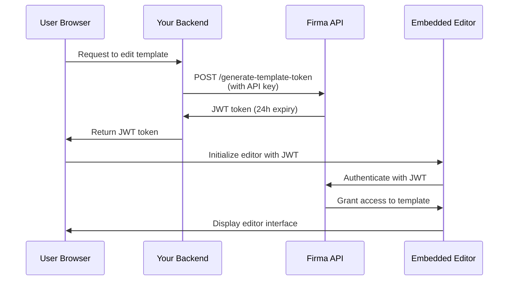

# Autenticazione API e token JWT

L'API di Firma utilizza due metodi di autenticazione: autenticazione con chiave API per le richieste server-to-server e token JWT per incorporare gli editor di template e di richieste di firma nella tua applicazione.

## Autenticazione con chiave API

Tutti gli endpoint API richiedono l'autenticazione tramite una chiave API nell'header `Authorization`.

### Come funziona

La tua chiave API autentica le richieste e determina a quali risorse del workspace puoi accedere. Ogni workspace ha la propria chiave API univoca che puoi recuperare tramite l'endpoint [Get Workspace](/api-reference/v01.15.00/workspaces/get-a-workspace).

**Workspace protetto**: ogni account aziendale ha un workspace protetto che non può essere eliminato. Questo workspace protetto contiene la chiave API principale del tuo account, che ha accesso a tutti gli endpoint di workspace, chiavi API, azienda/account e webhook. Usa questa chiave per operazioni a livello di account o quando devi gestire più workspace.

### Modalità test (chiavi Live vs Test)

Ogni workspace ha **due** chiavi API: una chiave **live** e una chiave **test**. La modalità test è determinata da quale chiave invii — non esiste un flag o parametro separato.

- Le richieste autenticate con la chiave **test** **non** consumano crediti e le eventuali richieste di firma create sono contrassegnate come test e con watermark.
- Le richieste autenticate con la chiave **live** vengono eseguite normalmente e consumano crediti.

Entrambe le chiavi vengono restituite quando crei un workspace (`api_key` = live, `test_api_key` = test) e dagli endpoint [Get Workspace](/api-reference/v01.24.00/workspaces/get-a-workspace) e List Workspaces. Usa la chiave test durante l'integrazione, quindi passa alla chiave live per la produzione.

Puoi ruotare ciascun tipo di chiave in modo indipendente: passa `key_type` (`"live"` o `"test"`, predefinito `"live"`) agli endpoint di [rigenerazione](/api-reference/v01.24.00/workspaces/regenerate-workspace-api-key) e [scadenza](/api-reference/v01.24.00/workspaces/expire-pending-api-keys). Ruotare un tipo non influenza l'altro.

<Note>
  Le chiavi test sono credenziali complete con lo stesso ambito di accesso delle chiavi live — tienile lato server e non esporle mai nel codice client. L'unica differenza è il comportamento di fatturazione e watermarking.
</Note>

### Rotazione delle chiavi API

Puoi rigenerare le chiavi API per i workspace non protetti per aumentare la sicurezza. Quando rigeneri una chiave:

1. **Viene creata immediatamente una nuova chiave API** e restituita nella risposta
2. **Le vecchie chiavi vengono impostate per scadere in 24 ore** - continuano a funzionare durante questo periodo di grazia
3. **Puoi far scadere manualmente le vecchie chiavi prima** una volta verificato che la nuova chiave funziona

<Note>
  **Le chiavi dei workspace protetti non possono essere rigenerate** tramite l'API. Questo previene blocchi accidentali dell'account. Contatta il supporto se devi ruotare la chiave del workspace protetto.
</Note>

#### Rigenerare la chiave API

Genera una nuova chiave API per un workspace. La vecchia chiave scadrà automaticamente dopo 24 ore:

```javascript
const response = await fetch(
  `https://api.firma.dev/functions/v1/signing-request-api/workspaces/${workspaceId}/api-key/regenerate`,
  {
    method: 'POST',
    headers: {
      'Authorization': process.env.FIRMA_API_KEY,
      'Content-Type': 'application/json'
    }
  }
);

const result = await response.json();
console.log('New API key:', result.new_key);
// Memorizza la nuova chiave in modo sicuro
```

**Risposta:**

```json
{
  "message": "API key regenerated. Old keys will expire in 24 hours.",
  "workspace_id": "123e4567-e89b-12d3-a456-426614174000",
  "new_key": "firma_api_abc123xyz...",
  "expiring_keys": [
    {
      "id": "old-key-uuid",
      "expires_at": "2025-12-19T10:30:00Z"
    }
  ]
}
```

#### Far scadere anticipatamente le vecchie chiavi

Dopo aver verificato che la tua nuova chiave funziona, puoi far scadere immediatamente tutte le chiavi in attesa:

```javascript
const response = await fetch(
  `https://api.firma.dev/functions/v1/signing-request-api/workspaces/${workspaceId}/api-key/expire`,
  {
    method: 'POST',
    headers: {
      'Authorization': process.env.FIRMA_API_KEY,
      'Content-Type': 'application/json'
    }
  }
);

const result = await response.json();
console.log(`Expired ${result.expired_count} key(s)`);
```

**Risposta:**

```json
{
  "message": "Expired 1 pending API key(s)",
  "workspace_id": "123e4567-e89b-12d3-a456-426614174000",
  "expired_count": 1,
  "expired_keys": ["old-key-uuid"]
}
```

**Best practice per la rotazione delle chiavi:**

1. Chiama l'endpoint di rigenerazione per ottenere una nuova chiave
2. Aggiorna la configurazione dell'applicazione con la nuova chiave
3. Verifica che la nuova chiave funzioni correttamente
4. Chiama l'endpoint di scadenza per invalidare immediatamente le vecchie chiavi
5. Monitora eventuali errori che indichino servizi che ancora usano la vecchia chiave

<Warning>
  **Non esporre mai la tua chiave API nel codice frontend o in applicazioni lato client.** Le chiavi API devono essere usate solo in servizi backend sicuri. Memorizzale sempre come variabili d'ambiente.
</Warning>

### Formato dell'header

La chiave API può essere inviata in due modi:

1. **Formato diretto** (consigliato per semplicità):

```bash
Authorization: your-api-key-here
```

2. **Formato Bearer token** (opzionale):

```bash
Authorization: Bearer your-api-key-here
```

Entrambi i formati sono accettati. Il prefisso Bearer è opzionale ma non richiesto.

### Esempi di codice

<CodeGroup>

```bash cURL
curl https://api.firma.dev/functions/v1/signing-request-api/templates \
  -H "Authorization: YOUR_API_KEY" \
  -H "Content-Type: application/json"
```


```javascript JavaScript
const response = await fetch(
  'https://api.firma.dev/functions/v1/signing-request-api/templates',
  {
    headers: {
      'Authorization': process.env.FIRMA_API_KEY,
      'Content-Type': 'application/json'
    }
  }
);

const templates = await response.json();
```


```python Python
import os
import requests

headers = {
    'Authorization': os.environ['FIRMA_API_KEY'],
    'Content-Type': 'application/json'
}

response = requests.get(
    'https://api.firma.dev/functions/v1/signing-request-api/templates',
    headers=headers
)

templates = response.json()
```

</CodeGroup>

### Risposta di errore

Se la tua chiave API è mancante o non valida, riceverai una risposta `401 Unauthorized`:

```json
{
  "error": "Unauthorized",
  "code": "UNAUTHORIZED",
  "message": "Invalid or missing API key"
}
```

---

## Token JWT per funzionalità incorporate

I token JWT (JSON Web Token) ti permettono di incorporare l'editor di template e l'editor di richieste di firma di Firma direttamente nella tua applicazione. Questi token sono firmati con RSA-256 e a tempo limitato per motivi di sicurezza.

### Quando usare i token JWT

Usa i token JWT quando vuoi:

- Incorporare l'editor di template nella tua applicazione affinché gli utenti creino/modifichino i template dei documenti
- Incorporare l'editor di richieste di firma affinché gli utenti personalizzino i documenti prima dell'invio
- Fornire accesso sicuro e a tempo limitato a template o richieste di firma specifici
- Controllare a quali risorse gli utenti possono accedere senza esporre la tua chiave API

<Note>
  **I token JWT devono sempre essere generati dal tuo backend sicuro**, mai dal codice frontend. Il tuo backend usa la chiave API per generare i token, che vengono poi passati al frontend per l'inizializzazione dell'editor.
</Note>

### Tipi di token JWT

| Tipo di token             | Endpoint                                                                                                                         | Scadenza   | Caso d'uso                                              |
| ------------------------- | -------------------------------------------------------------------------------------------------------------------------------- | ---------- | ------------------------------------------------------- |
| **Token Template**        | [Generate JWT Token for Embedding Templates](/api-reference/v01.15.00/jwt-management/generate-jwt-token-for-embedding-templates) | 24 ore     | Incorporare l'editor di template per creare/modificare template |
| **Token Signing Request** | [Generate JWT Token for Signing Request](/api-reference/v01.15.00/jwt-management/generate-jwt-token-for-signing-request)         | 24 ore     | Incorporare l'editor di richieste di firma per la personalizzazione dei documenti |

### Flusso di autenticazione

Ecco come funziona l'autenticazione JWT per le funzionalità incorporate:



### Guida all'implementazione

#### Passaggio 1: generare il token JWT (Backend)

Genera un token JWT dal tuo backend sicuro usando la tua chiave API:

<CodeGroup>

```javascript Node.js/Express
// Endpoint di backend per generare JWT per la modifica del template
app.post('/api/get-template-token', async (req, res) => {
  const { templateId } = req.body;

  try {
    const response = await fetch(
      'https://api.firma.dev/functions/v1/signing-request-api/generate-template-token',
      {
        method: 'POST',
        headers: {
          'Authorization': process.env.FIRMA_API_KEY,
          'Content-Type': 'application/json'
        },
        body: JSON.stringify({
          companies_workspaces_templates_id: templateId
        })
      }
    );

    const data = await response.json();
    
    // Restituisci il JWT al frontend (non esporre mai la chiave API)
    res.json({ 
      token: data.jwt,
      expiresAt: data.expires_at 
    });
  } catch (error) {
    res.status(500).json({ error: 'Failed to generate token' });
  }
});
```


```python Python/Flask
from flask import Flask, request, jsonify
import os
import requests

app = Flask(__name__)

@app.route('/api/get-template-token', methods=['POST'])
def get_template_token():
    template_id = request.json.get('templateId')
    
    try:
        response = requests.post(
            'https://api.firma.dev/functions/v1/signing-request-api/generate-template-token',
            headers={
                'Authorization': os.environ['FIRMA_API_KEY'],
                'Content-Type': 'application/json'
            },
            json={
                'companies_workspaces_templates_id': template_id
            }
        )
        
        data = response.json()
        
        # Restituisci il JWT al frontend (non esporre mai la chiave API)
        return jsonify({
            'token': data['jwt'],
            'expiresAt': data['expires_at']
        })
    except Exception as e:
        return jsonify({'error': 'Failed to generate token'}), 500
```

</CodeGroup>

**Risposta:**

```json
{
  "jwt": "eyJhbGciOiJSUzI1NiIsInR5cCI6IkpXVCJ9...",
  "jwt_id": "a1b2c3d4-e5f6-7g8h-9i0j-k1l2m3n4o5p6",
  "expires_at": "2025-12-18T10:00:00Z",
  "template_id": "template-uuid-here"
}
```

#### Passaggio 2: inizializzare l'editor (Frontend)

Usa il token JWT per inizializzare l'editor incorporato nel tuo frontend:

```html
<!DOCTYPE html>
<html>
<head>
  <title>Template Editor</title>
  <!-- Carica la libreria Firma Template Editor -->
  <script src="https://api.firma.dev/functions/v1/embed-proxy/template-editor.js"></script>
</head>
<body>
  <div id="firma-editor-container" style="width: 100%; height: 600px;"></div>

  <script>
    async function initializeEditor(templateId) {
      // Richiedi il JWT dal tuo backend
      const response = await fetch('/api/get-template-token', {
        method: 'POST',
        headers: { 'Content-Type': 'application/json' },
        body: JSON.stringify({ templateId })
      });

      const { token, expiresAt } = await response.json();

      // Inizializza l'editor incorporato
      window.FirmaTemplateEditor.init({
        container: '#firma-editor-container',
        jwt: token,
        templateId: templateId,
        theme: 'light', // o 'dark'
        readOnly: false,
        onSave: (savedData) => {
          console.log('Template saved successfully:', savedData);
        },
        onError: (error) => {
          console.error('Editor error:', error);
        },
        onLoad: (template) => {
          console.log('Template loaded:', template);
        }
      });
    }

    // Inizializza con il tuo template ID
    initializeEditor('your-template-id-here');
  </script>
</body>
</html>
```

Per l'editor di richieste di firma, usa l'endpoint JWT della signing request e la libreria dell'editor della signing request:

```javascript
// Genera il token della signing request dal backend
const response = await fetch('/api/get-signing-request-token', {
  method: 'POST',
  headers: { 'Content-Type': 'application/json' },
  body: JSON.stringify({ signingRequestId })
});

const { token } = await response.json();

// Carica la libreria dell'editor della signing request
// <script src="https://api.firma.dev/functions/v1/embed-proxy/signing-request-editor.js"></script>

// Inizializza l'editor della signing request
window.FirmaSigningRequestEditor.init({
  container: '#firma-signing-request-container',
  jwt: token,
  signingRequestId: signingRequestId,
  theme: 'light',
  onSave: (data) => console.log('Signing request saved:', data),
  onSend: (data) => console.log('Signing request sent:', data),
  onError: (error) => console.error('Error:', error)
});
```

#### Passaggio 3: revocare il token JWT (opzionale)

Revoca un token JWT quando non è più necessario:

<CodeGroup>

```javascript Node.js
const response = await fetch(
  'https://api.firma.dev/functions/v1/signing-request-api/revoke-template-token',
  {
    method: 'POST',
    headers: {
      'Authorization': process.env.FIRMA_API_KEY,
      'Content-Type': 'application/json'
    },
    body: JSON.stringify({
      jwt_id: 'a1b2c3d4-e5f6-7g8h-9i0j-k1l2m3n4o5p6'
    })
  }
);

const result = await response.json();
// { message: "JWT revoked successfully", jwt_id: "...", revoked_at: "..." }
```


```python Python
response = requests.post(
    'https://api.firma.dev/functions/v1/signing-request-api/revoke-template-token',
    headers={
        'Authorization': os.environ['FIRMA_API_KEY'],
        'Content-Type': 'application/json'
    },
    json={
        'jwt_id': 'a1b2c3d4-e5f6-7g8h-9i0j-k1l2m3n4o5p6'
    }
)

result = response.json()
```

</CodeGroup>

### Best practice di sicurezza per JWT

<Warning>
  **Checklist di sicurezza:**

  1. ✅ **Genera sempre i JWT dal tuo backend** - Non esporre mai la tua chiave API nel codice frontend
  2. ✅ **Usa variabili d'ambiente** - Memorizza le chiavi API in modo sicuro, non le hardcodare mai
  3. ✅ **Convalida la scadenza del token** - Controlla `expires_at` e aggiorna i token secondo necessità
  4. ✅ **Usa solo HTTPS** - Non trasmettere mai i token su connessioni non crittografate
  5. ✅ **Revoca i token non utilizzati** - Revoca i JWT quando la modifica è completa o la sessione termina
  6. ✅ **Implementa il refresh dei token** - Richiedi nuovi token prima della scadenza per le sessioni in corso
  7. ✅ **Assegna ambiti appropriati ai token** - Ogni JWT è legato a un template o una signing request specifica
</Warning>

---

## 

---

## Guide correlate

Scopri di più sull'implementazione delle funzionalità incorporate e sul lavoro con l'API:

- [Editor di template incorporabile](/guides/embeddable-template-editor) - Guida completa all'incorporamento dell'editor di template
- [Editor di richieste di firma incorporabile](/guides/embeddable-signing-request-editor) - Incorporare la personalizzazione delle richieste di firma
- [Invio di richieste di firma](/guides/sending-signing-request) - Invia documenti per la firma
- [Webhook](/guides/webhooks) - Iscriviti agli eventi in tempo reale

## Riferimento API

Endpoint principali di autenticazione e gestione JWT:

**Gestione delle chiavi API:**

- [Get Workspace](/api-reference/v01.15.00/workspaces/get-a-workspace) - Recupera la chiave API del workspace
- [Regenerate Workspace API Key](/api-reference/v01.15.00/workspaces/regenerate-workspace-api-key) - Genera una nuova chiave API
- [Expire Pending API Keys](/api-reference/v01.15.00/workspaces/expire-pending-api-keys) - Fai scadere immediatamente le vecchie chiavi

**Gestione dei token JWT:**

- [Generate JWT Token for Embedding Templates](/api-reference/v01.15.00/jwt-management/generate-jwt-token-for-embedding-templates)
- [Generate JWT Token for Signing Request](/api-reference/v01.15.00/jwt-management/generate-jwt-token-for-signing-request)
- [Revoke Template JWT Token](/api-reference/v01.15.00/jwt-management/revoke-template-jwt-token)
- [Revoke Signing Request JWT Token](/api-reference/v01.15.00/jwt-management/revoke-a-signing-request-jwt-token)

**Per iniziare:**

- [Get Company Information](/api-reference/v01.15.00/company/get-company-information)
- [Create Template](/api-reference/v01.15.00/templates/create-template)
- [Create Signing Request](/api-reference/v01.15.00/signing-requests/create-signing-request)
