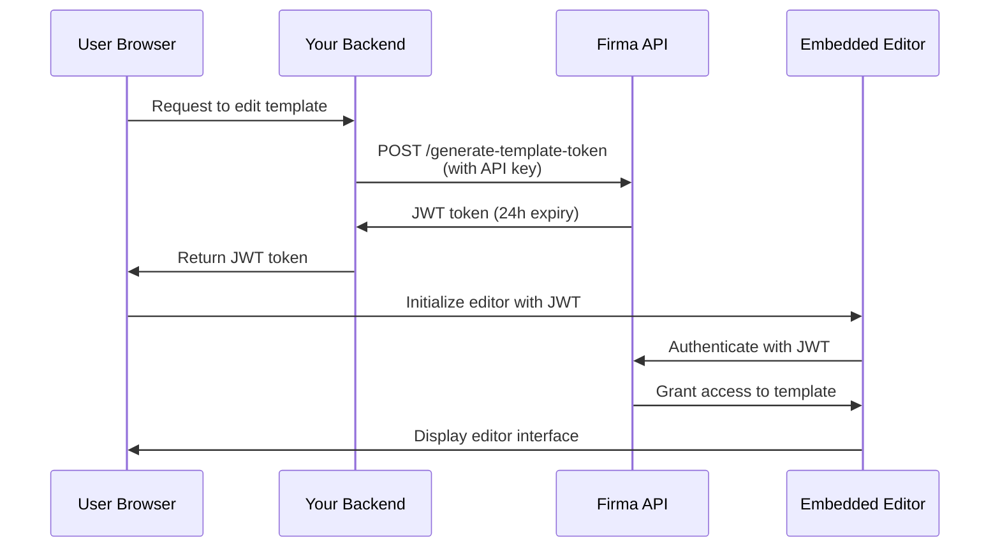

# Uwierzytelnianie API i tokeny JWT

API Firma używa dwóch metod uwierzytelniania: uwierzytelniania kluczem API dla żądań serwer-serwer oraz tokenów JWT do osadzania edytorów szablonów i żądań podpisu w Twojej aplikacji.

## Uwierzytelnianie kluczem API

Wszystkie endpointy API wymagają uwierzytelnienia przy użyciu klucza API w nagłówku `Authorization`.

### Jak to działa

Twój klucz API uwierzytelnia żądania i określa, do jakich zasobów workspace masz dostęp. Każdy workspace ma swój unikalny klucz API, który możesz pobrać przez endpoint [Get Workspace](/api-reference/v01.15.00/workspaces/get-a-workspace).

**Chroniony workspace**: Każde konto firmowe ma jeden chroniony workspace, którego nie można usunąć. Ten chroniony workspace przechowuje główny klucz API dla Twojego konta, który ma dostęp do wszystkich endpointów workspace, klucza API, firmy/konta i webhooków. Użyj tego klucza do operacji obejmujących całe konto lub gdy musisz zarządzać wieloma workspace'ami.

### Tryb testowy (klucze Live vs Test)

Każdy workspace ma **dwa** klucze API: klucz **live** i klucz **test**. Tryb testowy jest określany przez to, którego klucza używasz — nie ma oddzielnej flagi ani parametru.

- Żądania uwierzytelnione kluczem **test** **nie** zużywają kredytów, a wszelkie utworzone żądania podpisu są oznaczane jako testowe i posiadają znak wodny.
- Żądania uwierzytelnione kluczem **live** działają normalnie i zużywają kredyty.

Oba klucze są zwracane podczas tworzenia workspace'a (`api_key` = live, `test_api_key` = test) oraz przez endpointy [Get Workspace](/api-reference/v01.24.00/workspaces/get-a-workspace) i List Workspaces. Użyj klucza testowego podczas integracji, a następnie przełącz się na klucz live w produkcji.

Możesz niezależnie rotować każdy typ klucza: przekaż `key_type` (`"live"` lub `"test"`, domyślnie `"live"`) do endpointów [regenerate](/api-reference/v01.24.00/workspaces/regenerate-workspace-api-key) i [expire](/api-reference/v01.24.00/workspaces/expire-pending-api-keys). Rotacja jednego typu nie wpływa na drugi.

<Note>
  Klucze testowe to pełne poświadczenia z takim samym zakresem dostępu jak klucze live — trzymaj je po stronie serwera i nigdy nie ujawniaj w kodzie klienta. Jedyną różnicą jest zachowanie w zakresie rozliczeń i znaków wodnych.
</Note>

### Rotacja klucza API

Możesz regenerować klucze API dla niechronionych workspace'ów, aby zwiększyć bezpieczeństwo. Podczas regeneracji klucza:

1. **Nowy klucz API jest tworzony natychmiast** i zwracany w odpowiedzi
2. **Stare klucze są ustawione na wygaśnięcie za 24 godziny** — nadal działają w tym okresie karencji
3. **Możesz ręcznie wygasić stare klucze wcześniej**, gdy zweryfikujesz działanie nowego klucza

<Note>
  **Nie można regenerować kluczy chronionego workspace'a** przez API. Zapobiega to przypadkowej utracie dostępu do konta. Skontaktuj się z pomocą techniczną, jeśli chcesz zrotować klucz chronionego workspace'a.
</Note>

#### Regeneracja klucza API

Wygeneruj nowy klucz API dla workspace'a. Stary klucz automatycznie wygaśnie po 24 godzinach:

```javascript
const response = await fetch(
  `https://api.firma.dev/functions/v1/signing-request-api/workspaces/${workspaceId}/api-key/regenerate`,
  {
    method: 'POST',
    headers: {
      'Authorization': process.env.FIRMA_API_KEY,
      'Content-Type': 'application/json'
    }
  }
);

const result = await response.json();
console.log('New API key:', result.new_key);
// Bezpiecznie przechowaj nowy klucz
```

**Odpowiedź:**

```json
{
  "message": "API key regenerated. Old keys will expire in 24 hours.",
  "workspace_id": "123e4567-e89b-12d3-a456-426614174000",
  "new_key": "firma_api_abc123xyz...",
  "expiring_keys": [
    {
      "id": "old-key-uuid",
      "expires_at": "2025-12-19T10:30:00Z"
    }
  ]
}
```

#### Wcześniejsze wygaszenie starych kluczy

Po zweryfikowaniu działania nowego klucza możesz natychmiast wygasić wszystkie oczekujące klucze:

```javascript
const response = await fetch(
  `https://api.firma.dev/functions/v1/signing-request-api/workspaces/${workspaceId}/api-key/expire`,
  {
    method: 'POST',
    headers: {
      'Authorization': process.env.FIRMA_API_KEY,
      'Content-Type': 'application/json'
    }
  }
);

const result = await response.json();
console.log(`Expired ${result.expired_count} key(s)`);
```

**Odpowiedź:**

```json
{
  "message": "Expired 1 pending API key(s)",
  "workspace_id": "123e4567-e89b-12d3-a456-426614174000",
  "expired_count": 1,
  "expired_keys": ["old-key-uuid"]
}
```

**Najlepsza praktyka rotacji klucza:**

1. Wywołaj endpoint regeneracji, aby uzyskać nowy klucz
2. Zaktualizuj konfigurację aplikacji nowym kluczem
3. Przetestuj, czy nowy klucz działa poprawnie
4. Wywołaj endpoint wygaszania, aby natychmiast unieważnić stare klucze
5. Monitoruj błędy wskazujące na usługi nadal używające starego klucza

<Warning>
  **Nigdy nie ujawniaj klucza API w kodzie frontendu ani aplikacjach po stronie klienta.** Klucze API powinny być używane tylko w bezpiecznych usługach backendu. Zawsze przechowuj je jako zmienne środowiskowe.
</Warning>

### Format nagłówka

Klucz API może być wysyłany na dwa sposoby:

1. **Format bezpośredni** (zalecany dla prostoty):

```bash
Authorization: your-api-key-here
```

2. **Format Bearer** (opcjonalny):

```bash
Authorization: Bearer your-api-key-here
```

Oba formaty są akceptowane. Prefiks Bearer jest opcjonalny, ale nie jest wymagany.

### Przykłady kodu

<CodeGroup>

```bash cURL
curl https://api.firma.dev/functions/v1/signing-request-api/templates \
  -H "Authorization: YOUR_API_KEY" \
  -H "Content-Type: application/json"
```


```javascript JavaScript
const response = await fetch(
  'https://api.firma.dev/functions/v1/signing-request-api/templates',
  {
    headers: {
      'Authorization': process.env.FIRMA_API_KEY,
      'Content-Type': 'application/json'
    }
  }
);

const templates = await response.json();
```


```python Python
import os
import requests

headers = {
    'Authorization': os.environ['FIRMA_API_KEY'],
    'Content-Type': 'application/json'
}

response = requests.get(
    'https://api.firma.dev/functions/v1/signing-request-api/templates',
    headers=headers
)

templates = response.json()
```

</CodeGroup>

### Odpowiedź z błędem

Jeśli Twój klucz API jest nieobecny lub nieprawidłowy, otrzymasz odpowiedź `401 Unauthorized`:

```json
{
  "error": "Unauthorized",
  "code": "UNAUTHORIZED",
  "message": "Invalid or missing API key"
}
```

---

## Tokeny JWT dla funkcji osadzonych

Tokeny JWT (JSON Web Token) umożliwiają osadzanie edytora szablonów i edytora żądań podpisu Firma bezpośrednio w Twojej aplikacji. Te tokeny są podpisywane algorytmem RSA-256 i mają ograniczony czas życia dla bezpieczeństwa.

### Kiedy używać tokenów JWT

Używaj tokenów JWT, gdy chcesz:

- Osadzić edytor szablonów w aplikacji, aby użytkownicy mogli tworzyć/edytować szablony dokumentów
- Osadzić edytor żądań podpisu, aby użytkownicy mogli dostosować dokumenty przed wysłaniem
- Zapewnić bezpieczny, ograniczony czasowo dostęp do konkretnych szablonów lub żądań podpisu
- Kontrolować, do jakich zasobów użytkownicy mają dostęp, bez ujawniania klucza API

<Note>
  **Tokeny JWT powinny zawsze być generowane z bezpiecznego backendu**, nigdy z kodu frontendu. Twój backend używa klucza API do generowania tokenów, które są następnie przekazywane do frontendu w celu inicjalizacji edytora.
</Note>

### Typy tokenów JWT

| Typ tokenu                | Endpoint                                                                                                                         | Wygaśnięcie | Przypadek użycia                                                |
| ------------------------- | -------------------------------------------------------------------------------------------------------------------------------- | ---------- | ------------------------------------------------------- |
| **Token szablonu**        | [Generate JWT Token for Embedding Templates](/api-reference/v01.15.00/jwt-management/generate-jwt-token-for-embedding-templates) | 24 godziny   | Osadzenie edytora szablonów do tworzenia/edycji szablonów    |
| **Token żądania podpisu** | [Generate JWT Token for Signing Request](/api-reference/v01.15.00/jwt-management/generate-jwt-token-for-signing-request)         | 24 godziny   | Osadzenie edytora żądań podpisu do dostosowania dokumentu |

### Przepływ uwierzytelniania

Oto jak działa uwierzytelnianie JWT dla funkcji osadzonych:



### Przewodnik implementacji

#### Krok 1: Wygeneruj token JWT (backend)

Wygeneruj token JWT z bezpiecznego backendu, używając swojego klucza API:

<CodeGroup>

```javascript Node.js/Express
// Endpoint backendu do generowania JWT dla edycji szablonu
app.post('/api/get-template-token', async (req, res) => {
  const { templateId } = req.body;

  try {
    const response = await fetch(
      'https://api.firma.dev/functions/v1/signing-request-api/generate-template-token',
      {
        method: 'POST',
        headers: {
          'Authorization': process.env.FIRMA_API_KEY,
          'Content-Type': 'application/json'
        },
        body: JSON.stringify({
          companies_workspaces_templates_id: templateId
        })
      }
    );

    const data = await response.json();
    
    // Zwróć JWT do frontendu (nigdy nie ujawniaj klucza API)
    res.json({ 
      token: data.jwt,
      expiresAt: data.expires_at 
    });
  } catch (error) {
    res.status(500).json({ error: 'Failed to generate token' });
  }
});
```


```python Python/Flask
from flask import Flask, request, jsonify
import os
import requests

app = Flask(__name__)

@app.route('/api/get-template-token', methods=['POST'])
def get_template_token():
    template_id = request.json.get('templateId')
    
    try:
        response = requests.post(
            'https://api.firma.dev/functions/v1/signing-request-api/generate-template-token',
            headers={
                'Authorization': os.environ['FIRMA_API_KEY'],
                'Content-Type': 'application/json'
            },
            json={
                'companies_workspaces_templates_id': template_id
            }
        )
        
        data = response.json()
        
        # Zwróć JWT do frontendu (nigdy nie ujawniaj klucza API)
        return jsonify({
            'token': data['jwt'],
            'expiresAt': data['expires_at']
        })
    except Exception as e:
        return jsonify({'error': 'Failed to generate token'}), 500
```

</CodeGroup>

**Odpowiedź:**

```json
{
  "jwt": "eyJhbGciOiJSUzI1NiIsInR5cCI6IkpXVCJ9...",
  "jwt_id": "a1b2c3d4-e5f6-7g8h-9i0j-k1l2m3n4o5p6",
  "expires_at": "2025-12-18T10:00:00Z",
  "template_id": "template-uuid-here"
}
```

#### Krok 2: Inicjalizuj edytor (frontend)

Użyj tokenu JWT, aby zainicjalizować osadzony edytor w swoim frontendzie:

```html
<!DOCTYPE html>
<html>
<head>
  <title>Template Editor</title>
  <!-- Załaduj bibliotekę Firma Template Editor -->
  <script src="https://api.firma.dev/functions/v1/embed-proxy/template-editor.js"></script>
</head>
<body>
  <div id="firma-editor-container" style="width: 100%; height: 600px;"></div>

  <script>
    async function initializeEditor(templateId) {
      // Poproś backend o JWT
      const response = await fetch('/api/get-template-token', {
        method: 'POST',
        headers: { 'Content-Type': 'application/json' },
        body: JSON.stringify({ templateId })
      });

      const { token, expiresAt } = await response.json();

      // Inicjalizuj osadzony edytor
      window.FirmaTemplateEditor.init({
        container: '#firma-editor-container',
        jwt: token,
        templateId: templateId,
        theme: 'light', // lub 'dark'
        readOnly: false,
        onSave: (savedData) => {
          console.log('Template saved successfully:', savedData);
        },
        onError: (error) => {
          console.error('Editor error:', error);
        },
        onLoad: (template) => {
          console.log('Template loaded:', template);
        }
      });
    }

    // Inicjalizuj z ID szablonu
    initializeEditor('your-template-id-here');
  </script>
</body>
</html>
```

Dla edytora żądań podpisu użyj endpointu JWT żądania podpisu i biblioteki edytora żądań podpisu:

```javascript
// Wygeneruj token żądania podpisu z backendu
const response = await fetch('/api/get-signing-request-token', {
  method: 'POST',
  headers: { 'Content-Type': 'application/json' },
  body: JSON.stringify({ signingRequestId })
});

const { token } = await response.json();

// Załaduj bibliotekę edytora żądań podpisu
// <script src="https://api.firma.dev/functions/v1/embed-proxy/signing-request-editor.js"></script>

// Inicjalizuj edytor żądań podpisu
window.FirmaSigningRequestEditor.init({
  container: '#firma-signing-request-container',
  jwt: token,
  signingRequestId: signingRequestId,
  theme: 'light',
  onSave: (data) => console.log('Signing request saved:', data),
  onSend: (data) => console.log('Signing request sent:', data),
  onError: (error) => console.error('Error:', error)
});
```

#### Krok 3: Odwołaj token JWT (opcjonalnie)

Odwołaj token JWT, gdy nie jest już potrzebny:

<CodeGroup>

```javascript Node.js
const response = await fetch(
  'https://api.firma.dev/functions/v1/signing-request-api/revoke-template-token',
  {
    method: 'POST',
    headers: {
      'Authorization': process.env.FIRMA_API_KEY,
      'Content-Type': 'application/json'
    },
    body: JSON.stringify({
      jwt_id: 'a1b2c3d4-e5f6-7g8h-9i0j-k1l2m3n4o5p6'
    })
  }
);

const result = await response.json();
// { message: "JWT revoked successfully", jwt_id: "...", revoked_at: "..." }
```


```python Python
response = requests.post(
    'https://api.firma.dev/functions/v1/signing-request-api/revoke-template-token',
    headers={
        'Authorization': os.environ['FIRMA_API_KEY'],
        'Content-Type': 'application/json'
    },
    json={
        'jwt_id': 'a1b2c3d4-e5f6-7g8h-9i0j-k1l2m3n4o5p6'
    }
)

result = response.json()
```

</CodeGroup>

### Najlepsze praktyki bezpieczeństwa JWT

<Warning>
  **Lista kontrolna bezpieczeństwa:**

  1. ✅ **Zawsze generuj JWT z backendu** — nigdy nie ujawniaj klucza API w kodzie frontendu
  2. ✅ **Używaj zmiennych środowiskowych** — bezpiecznie przechowuj klucze API, nigdy nie umieszczaj ich w kodzie
  3. ✅ **Weryfikuj wygaśnięcie tokenu** — sprawdzaj `expires_at` i odświeżaj tokeny w razie potrzeby
  4. ✅ **Używaj tylko HTTPS** — nigdy nie przesyłaj tokenów przez nieszyfrowane połączenia
  5. ✅ **Odwołuj nieużywane tokeny** — odwołuj JWT po zakończeniu edycji lub sesji
  6. ✅ **Implementuj odświeżanie tokenów** — żądaj nowych tokenów przed wygaśnięciem dla trwających sesji
  7. ✅ **Odpowiednio ograniczaj zakres tokenów** — każdy JWT jest powiązany z konkretnym szablonem lub żądaniem podpisu
</Warning>

---

## 

---

## Powiązane przewodniki

Dowiedz się więcej o implementacji funkcji osadzonych i pracy z API:

- [Osadzany edytor szablonów](/guides/embeddable-template-editor) — kompletny przewodnik po osadzaniu edytora szablonów
- [Osadzany edytor żądań podpisu](/guides/embeddable-signing-request-editor) — osadź dostosowanie żądań podpisu
- [Wysyłanie żądań podpisu](/guides/sending-signing-request) — wysyłaj dokumenty do podpisu
- [Webhooki](/guides/webhooks) — subskrybuj zdarzenia w czasie rzeczywistym

## Dokumentacja API

Kluczowe endpointy uwierzytelniania i zarządzania JWT:

**Zarządzanie kluczem API:**

- [Get Workspace](/api-reference/v01.15.00/workspaces/get-a-workspace) — pobierz klucz API workspace'a
- [Regenerate Workspace API Key](/api-reference/v01.15.00/workspaces/regenerate-workspace-api-key) — wygeneruj nowy klucz API
- [Expire Pending API Keys](/api-reference/v01.15.00/workspaces/expire-pending-api-keys) — natychmiast wygaś stare klucze

**Zarządzanie tokenami JWT:**

- [Generate JWT Token for Embedding Templates](/api-reference/v01.15.00/jwt-management/generate-jwt-token-for-embedding-templates)
- [Generate JWT Token for Signing Request](/api-reference/v01.15.00/jwt-management/generate-jwt-token-for-signing-request)
- [Revoke Template JWT Token](/api-reference/v01.15.00/jwt-management/revoke-template-jwt-token)
- [Revoke Signing Request JWT Token](/api-reference/v01.15.00/jwt-management/revoke-a-signing-request-jwt-token)

**Pierwsze kroki:**

- [Get Company Information](/api-reference/v01.15.00/company/get-company-information)
- [Create Template](/api-reference/v01.15.00/templates/create-template)
- [Create Signing Request](/api-reference/v01.15.00/signing-requests/create-signing-request)
