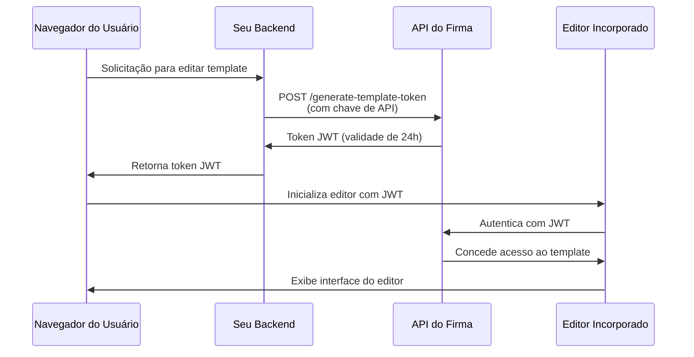

# Autenticação da API e tokens JWT

A API do Firma usa dois métodos de autenticação: autenticação por chave de API para requisições servidor-a-servidor e tokens JWT para incorporar os editores de template e de solicitação de assinatura na sua aplicação.

## Autenticação por chave de API

Todos os endpoints da API exigem autenticação por meio de uma chave de API no cabeçalho `Authorization`.

### Como funciona

Sua chave de API autentica suas requisições e determina a quais recursos de workspace você pode acessar. Cada workspace tem sua própria chave de API única que você pode obter pelo endpoint [Get Workspace](/api-reference/v01.15.00/workspaces/get-a-workspace).

**Workspace protegido**: cada conta de empresa tem um workspace protegido que não pode ser excluído. Este workspace protegido contém a chave de API principal da sua conta, que tem acesso a todos os endpoints de workspace, chave de API, empresa/conta e webhook. Use essa chave para operações em toda a conta ou quando precisar gerenciar múltiplos workspaces.

### Modo de teste (chaves live vs test)

Cada workspace tem **duas** chaves de API: uma chave **live** e uma chave **test**. O modo de teste é determinado por qual chave você envia — não há flag ou parâmetro separado.

- Requisições autenticadas com a chave **test** **não** consomem créditos, e quaisquer solicitações de assinatura que elas criem são marcadas como teste e com marca d'água.
- Requisições autenticadas com a chave **live** executam normalmente e consomem créditos.

Ambas as chaves são retornadas quando você cria um workspace (`api_key` = live, `test_api_key` = test) e pelos endpoints [Get Workspace](/api-reference/v01.24.00/workspaces/get-a-workspace) e List Workspaces. Use a chave de teste durante a integração e, em seguida, mude para a chave live em produção.

Você pode rotacionar cada tipo de chave independentemente: passe `key_type` (`"live"` ou `"test"`, padrão `"live"`) aos endpoints [regenerate](/api-reference/v01.24.00/workspaces/regenerate-workspace-api-key) e [expire](/api-reference/v01.24.00/workspaces/expire-pending-api-keys). Rotacionar um tipo não afeta o outro.

<Note>
  Chaves de teste são credenciais completas com o mesmo escopo de acesso das chaves live — mantenha-as no servidor e nunca as exponha em código do cliente. A única diferença é o comportamento de faturamento e marca d'água.
</Note>

### Rotação de chave de API

Você pode regenerar chaves de API para workspaces não protegidos para aumentar a segurança. Quando você regenera uma chave:

1. **Uma nova chave de API é criada imediatamente** e retornada na resposta
2. **As chaves antigas são configuradas para expirar em 24 horas** - elas continuam funcionando durante este período de graça
3. **Você pode expirar manualmente as chaves antigas antecipadamente** quando tiver verificado que a nova chave funciona

<Note>
  **Chaves de workspace protegido não podem ser regeneradas** via API. Isso evita bloqueios acidentais da sua conta. Entre em contato com o suporte se precisar rotacionar sua chave de workspace protegido.
</Note>

#### Regenerar chave de API

Gere uma nova chave de API para um workspace. A chave antiga expirará automaticamente após 24 horas:

```javascript
const response = await fetch(
  `https://api.firma.dev/functions/v1/signing-request-api/workspaces/${workspaceId}/api-key/regenerate`,
  {
    method: 'POST',
    headers: {
      'Authorization': process.env.FIRMA_API_KEY,
      'Content-Type': 'application/json'
    }
  }
);

const result = await response.json();
console.log('New API key:', result.new_key);
// Armazene a nova chave com segurança
```

**Resposta:**

```json
{
  "message": "API key regenerated. Old keys will expire in 24 hours.",
  "workspace_id": "123e4567-e89b-12d3-a456-426614174000",
  "new_key": "firma_api_abc123xyz...",
  "expiring_keys": [
    {
      "id": "old-key-uuid",
      "expires_at": "2025-12-19T10:30:00Z"
    }
  ]
}
```

#### Expirar chaves antigas antecipadamente

Depois de verificar que sua nova chave funciona, você pode expirar imediatamente todas as chaves pendentes:

```javascript
const response = await fetch(
  `https://api.firma.dev/functions/v1/signing-request-api/workspaces/${workspaceId}/api-key/expire`,
  {
    method: 'POST',
    headers: {
      'Authorization': process.env.FIRMA_API_KEY,
      'Content-Type': 'application/json'
    }
  }
);

const result = await response.json();
console.log(`Expired ${result.expired_count} key(s)`);
```

**Resposta:**

```json
{
  "message": "Expired 1 pending API key(s)",
  "workspace_id": "123e4567-e89b-12d3-a456-426614174000",
  "expired_count": 1,
  "expired_keys": ["old-key-uuid"]
}
```

**Melhor prática para rotação de chaves:**

1. Chame o endpoint de regenerar para obter uma nova chave
2. Atualize a configuração da sua aplicação com a nova chave
3. Teste se a nova chave funciona corretamente
4. Chame o endpoint de expirar para invalidar imediatamente as chaves antigas
5. Monitore quaisquer erros indicando serviços que ainda usam a chave antiga

<Warning>
  **Nunca exponha sua chave de API em código de frontend ou aplicações do lado do cliente.** Chaves de API só devem ser usadas em serviços de backend seguros. Sempre armazene-as como variáveis de ambiente.
</Warning>

### Formato do cabeçalho

A chave de API pode ser enviada de duas formas:

1. **Formato direto** (recomendado por simplicidade):

```bash
Authorization: your-api-key-here
```

2. **Formato bearer token** (opcional):

```bash
Authorization: Bearer your-api-key-here
```

Ambos os formatos são aceitos. O prefixo Bearer é opcional, mas não obrigatório.

### Exemplos de código

<CodeGroup>

```bash cURL
curl https://api.firma.dev/functions/v1/signing-request-api/templates \
  -H "Authorization: YOUR_API_KEY" \
  -H "Content-Type: application/json"
```


```javascript JavaScript
const response = await fetch(
  'https://api.firma.dev/functions/v1/signing-request-api/templates',
  {
    headers: {
      'Authorization': process.env.FIRMA_API_KEY,
      'Content-Type': 'application/json'
    }
  }
);

const templates = await response.json();
```


```python Python
import os
import requests

headers = {
    'Authorization': os.environ['FIRMA_API_KEY'],
    'Content-Type': 'application/json'
}

response = requests.get(
    'https://api.firma.dev/functions/v1/signing-request-api/templates',
    headers=headers
)

templates = response.json()
```

</CodeGroup>

### Resposta de erro

Se sua chave de API estiver ausente ou for inválida, você receberá uma resposta `401 Unauthorized`:

```json
{
  "error": "Unauthorized",
  "code": "UNAUTHORIZED",
  "message": "Invalid or missing API key"
}
```

---

## Tokens JWT para recursos incorporados

Tokens JWT (JSON Web Token) permitem incorporar o editor de templates e o editor de solicitações de assinatura do Firma diretamente na sua aplicação. Esses tokens são assinados com RSA-256 e têm tempo de vida limitado por segurança.

### Quando usar tokens JWT

Use tokens JWT quando você quiser:

- Incorporar o editor de templates na sua aplicação para que usuários criem/editem templates de documentos
- Incorporar o editor de solicitações de assinatura para que usuários personalizem documentos antes do envio
- Fornecer acesso seguro e por tempo limitado a templates ou solicitações de assinatura específicas
- Controlar quais recursos os usuários podem acessar sem expor sua chave de API

<Note>
  **Tokens JWT devem sempre ser gerados a partir do seu backend seguro**, nunca do código de frontend. Seu backend usa a chave de API para gerar tokens, que são então passados para o frontend para inicialização do editor.
</Note>

### Tipos de token JWT

| Tipo de token             | Endpoint                                                                                                                         | Expiração  | Caso de uso                                             |
| ------------------------- | -------------------------------------------------------------------------------------------------------------------------------- | ---------- | ------------------------------------------------------- |
| **Token de template**     | [Generate JWT Token for Embedding Templates](/api-reference/v01.15.00/jwt-management/generate-jwt-token-for-embedding-templates) | 24 horas   | Incorporar editor de templates para criar/editar templates |
| **Token de solicitação de assinatura** | [Generate JWT Token for Signing Request](/api-reference/v01.15.00/jwt-management/generate-jwt-token-for-signing-request)         | 24 horas   | Incorporar editor de solicitação de assinatura para personalização do documento |

### Fluxo de autenticação

Veja como funciona a autenticação JWT para recursos incorporados:



### Guia de implementação

#### Passo 1: gerar token JWT (backend)

Gere um token JWT a partir do seu backend seguro usando sua chave de API:

<CodeGroup>

```javascript Node.js/Express
// Endpoint de backend para gerar JWT para edição de template
app.post('/api/get-template-token', async (req, res) => {
  const { templateId } = req.body;

  try {
    const response = await fetch(
      'https://api.firma.dev/functions/v1/signing-request-api/generate-template-token',
      {
        method: 'POST',
        headers: {
          'Authorization': process.env.FIRMA_API_KEY,
          'Content-Type': 'application/json'
        },
        body: JSON.stringify({
          companies_workspaces_templates_id: templateId
        })
      }
    );

    const data = await response.json();
    
    // Retorne o JWT ao frontend (nunca exponha a chave de API)
    res.json({ 
      token: data.jwt,
      expiresAt: data.expires_at 
    });
  } catch (error) {
    res.status(500).json({ error: 'Failed to generate token' });
  }
});
```


```python Python/Flask
from flask import Flask, request, jsonify
import os
import requests

app = Flask(__name__)

@app.route('/api/get-template-token', methods=['POST'])
def get_template_token():
    template_id = request.json.get('templateId')
    
    try:
        response = requests.post(
            'https://api.firma.dev/functions/v1/signing-request-api/generate-template-token',
            headers={
                'Authorization': os.environ['FIRMA_API_KEY'],
                'Content-Type': 'application/json'
            },
            json={
                'companies_workspaces_templates_id': template_id
            }
        )
        
        data = response.json()
        
        # Retorne o JWT ao frontend (nunca exponha a chave de API)
        return jsonify({
            'token': data['jwt'],
            'expiresAt': data['expires_at']
        })
    except Exception as e:
        return jsonify({'error': 'Failed to generate token'}), 500
```

</CodeGroup>

**Resposta:**

```json
{
  "jwt": "eyJhbGciOiJSUzI1NiIsInR5cCI6IkpXVCJ9...",
  "jwt_id": "a1b2c3d4-e5f6-7g8h-9i0j-k1l2m3n4o5p6",
  "expires_at": "2025-12-18T10:00:00Z",
  "template_id": "template-uuid-here"
}
```

#### Passo 2: inicializar editor (frontend)

Use o token JWT para inicializar o editor incorporado no seu frontend:

```html
<!DOCTYPE html>
<html>
<head>
  <title>Template Editor</title>
  <!-- Carregue a biblioteca do editor de templates do Firma -->
  <script src="https://api.firma.dev/functions/v1/embed-proxy/template-editor.js"></script>
</head>
<body>
  <div id="firma-editor-container" style="width: 100%; height: 600px;"></div>

  <script>
    async function initializeEditor(templateId) {
      // Solicite o JWT do seu backend
      const response = await fetch('/api/get-template-token', {
        method: 'POST',
        headers: { 'Content-Type': 'application/json' },
        body: JSON.stringify({ templateId })
      });

      const { token, expiresAt } = await response.json();

      // Inicialize o editor incorporado
      window.FirmaTemplateEditor.init({
        container: '#firma-editor-container',
        jwt: token,
        templateId: templateId,
        theme: 'light', // ou 'dark'
        readOnly: false,
        onSave: (savedData) => {
          console.log('Template saved successfully:', savedData);
        },
        onError: (error) => {
          console.error('Editor error:', error);
        },
        onLoad: (template) => {
          console.log('Template loaded:', template);
        }
      });
    }

    // Inicialize com o ID do seu template
    initializeEditor('your-template-id-here');
  </script>
</body>
</html>
```

Para o editor de solicitação de assinatura, use o endpoint de JWT de solicitação de assinatura e a biblioteca do editor de solicitação de assinatura:

```javascript
// Gere token de solicitação de assinatura do backend
const response = await fetch('/api/get-signing-request-token', {
  method: 'POST',
  headers: { 'Content-Type': 'application/json' },
  body: JSON.stringify({ signingRequestId })
});

const { token } = await response.json();

// Carregue a biblioteca do editor de solicitação de assinatura
// <script src="https://api.firma.dev/functions/v1/embed-proxy/signing-request-editor.js"></script>

// Inicialize o editor de solicitação de assinatura
window.FirmaSigningRequestEditor.init({
  container: '#firma-signing-request-container',
  jwt: token,
  signingRequestId: signingRequestId,
  theme: 'light',
  onSave: (data) => console.log('Signing request saved:', data),
  onSend: (data) => console.log('Signing request sent:', data),
  onError: (error) => console.error('Error:', error)
});
```

#### Passo 3: revogar token JWT (opcional)

Revogue um token JWT quando ele não for mais necessário:

<CodeGroup>

```javascript Node.js
const response = await fetch(
  'https://api.firma.dev/functions/v1/signing-request-api/revoke-template-token',
  {
    method: 'POST',
    headers: {
      'Authorization': process.env.FIRMA_API_KEY,
      'Content-Type': 'application/json'
    },
    body: JSON.stringify({
      jwt_id: 'a1b2c3d4-e5f6-7g8h-9i0j-k1l2m3n4o5p6'
    })
  }
);

const result = await response.json();
// { message: "JWT revoked successfully", jwt_id: "...", revoked_at: "..." }
```


```python Python
response = requests.post(
    'https://api.firma.dev/functions/v1/signing-request-api/revoke-template-token',
    headers={
        'Authorization': os.environ['FIRMA_API_KEY'],
        'Content-Type': 'application/json'
    },
    json={
        'jwt_id': 'a1b2c3d4-e5f6-7g8h-9i0j-k1l2m3n4o5p6'
    }
)

result = response.json()
```

</CodeGroup>

### Melhores práticas de segurança para JWT

<Warning>
  **Checklist de segurança:**

  1. ✅ **Sempre gere JWTs a partir do seu backend** - Nunca exponha sua chave de API em código de frontend
  2. ✅ **Use variáveis de ambiente** - Armazene chaves de API com segurança, nunca as codifique diretamente
  3. ✅ **Valide a expiração do token** - Verifique `expires_at` e atualize tokens conforme necessário
  4. ✅ **Use apenas HTTPS** - Nunca transmita tokens em conexões não criptografadas
  5. ✅ **Revogue tokens não utilizados** - Revogue JWTs quando a edição for concluída ou a sessão terminar
  6. ✅ **Implemente refresh de token** - Solicite novos tokens antes da expiração para sessões em andamento
  7. ✅ **Escope os tokens adequadamente** - Cada JWT está vinculado a um template ou solicitação de assinatura específica
</Warning>

---

## 

---

## Guias relacionados

Saiba mais sobre a implementação de recursos incorporados e como trabalhar com a API:

- [Editor de templates incorporável](/guides/embeddable-template-editor) - Guia completo para incorporar o editor de templates
- [Editor de solicitação de assinatura incorporável](/guides/embeddable-signing-request-editor) - Incorpore personalização de solicitação de assinatura
- [Enviando solicitações de assinatura](/guides/sending-signing-request) - Envie documentos para assinatura
- [Webhooks](/guides/webhooks) - Assine eventos em tempo real

## Referência da API

Principais endpoints de autenticação e gerenciamento de JWT:

**Gerenciamento de chave de API:**

- [Get Workspace](/api-reference/v01.15.00/workspaces/get-a-workspace) - Obter chave de API do workspace
- [Regenerate Workspace API Key](/api-reference/v01.15.00/workspaces/regenerate-workspace-api-key) - Gerar nova chave de API
- [Expire Pending API Keys](/api-reference/v01.15.00/workspaces/expire-pending-api-keys) - Expirar imediatamente chaves antigas

**Gerenciamento de token JWT:**

- [Generate JWT Token for Embedding Templates](/api-reference/v01.15.00/jwt-management/generate-jwt-token-for-embedding-templates)
- [Generate JWT Token for Signing Request](/api-reference/v01.15.00/jwt-management/generate-jwt-token-for-signing-request)
- [Revoke Template JWT Token](/api-reference/v01.15.00/jwt-management/revoke-template-jwt-token)
- [Revoke Signing Request JWT Token](/api-reference/v01.15.00/jwt-management/revoke-a-signing-request-jwt-token)

**Começando:**

- [Get Company Information](/api-reference/v01.15.00/company/get-company-information)
- [Create Template](/api-reference/v01.15.00/templates/create-template)
- [Create Signing Request](/api-reference/v01.15.00/signing-requests/create-signing-request)
