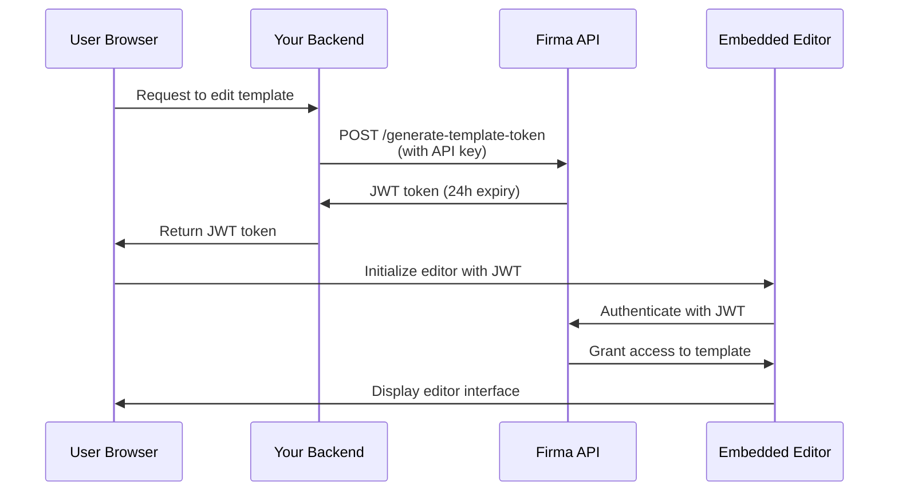

# Autenticação da API e tokens JWT

A API Firma utiliza dois métodos de autenticação: autenticação por chave de API para pedidos de servidor para servidor e tokens JWT para incorporar os editores de template e de signing request na sua aplicação.

## Autenticação por chave de API

Todos os endpoints da API requerem autenticação utilizando uma chave de API no cabeçalho `Authorization`.

### Como funciona

A sua chave de API autentica os seus pedidos e determina a que recursos de workspace pode aceder. Cada workspace tem a sua própria chave de API única que pode obter através do endpoint [Get Workspace](/api-reference/v01.15.00/workspaces/get-a-workspace).

**Workspace protegido**: cada conta de empresa tem um workspace protegido que não pode ser eliminado. Este workspace protegido detém a chave de API principal da sua conta, que tem acesso a todos os endpoints de workspace, chave de API, empresa/conta e webhook. Utilize esta chave para operações a nível de conta ou quando precisar de gerir múltiplos workspaces.

### Modo de teste (chaves live vs test)

Cada workspace tem **duas** chaves de API: uma chave **live** e uma chave **test**. O modo de teste é determinado pela chave que envia — não há flag ou parâmetro separado.

- Pedidos autenticados com a chave **test** **não** consomem créditos, e quaisquer signing requests que criem são marcados como teste e com marca de água.
- Pedidos autenticados com a chave **live** correm normalmente e consomem créditos.

Ambas as chaves são devolvidas ao criar um workspace (`api_key` = live, `test_api_key` = test) e pelos endpoints [Get Workspace](/api-reference/v01.24.00/workspaces/get-a-workspace) e List Workspaces. Utilize a chave de teste durante a integração e, em seguida, mude para a chave live para produção.

Pode rodar cada tipo de chave independentemente: passe `key_type` (`"live"` ou `"test"`, por defeito `"live"`) aos endpoints [regenerate](/api-reference/v01.24.00/workspaces/regenerate-workspace-api-key) e [expire](/api-reference/v01.24.00/workspaces/expire-pending-api-keys). Rodar um tipo não afeta o outro.

<Note>
  As chaves de teste são credenciais completas com o mesmo âmbito de acesso das chaves live — mantenha-as no servidor e nunca as exponha em código de cliente. A única diferença é o comportamento de faturação e de marca de água.
</Note>

### Rotação de chave de API

Pode regenerar chaves de API para workspaces não protegidos para melhorar a segurança. Quando regenera uma chave:

1. **É criada imediatamente uma nova chave de API** e devolvida na resposta
2. **As chaves antigas ficam definidas para expirar em 24 horas** — continuam a funcionar durante este período de tolerância
3. **Pode expirar manualmente as chaves antigas mais cedo** assim que verificar que a nova chave funciona

<Note>
  **As chaves de workspace protegido não podem ser regeneradas** via API. Isto evita bloqueios acidentais da sua conta. Contacte o suporte se precisar de rodar a chave do seu workspace protegido.
</Note>

#### Regenerar chave de API

Gere uma nova chave de API para um workspace. A chave antiga expirará automaticamente após 24 horas:

```javascript
const response = await fetch(
  `https://api.firma.dev/functions/v1/signing-request-api/workspaces/${workspaceId}/api-key/regenerate`,
  {
    method: 'POST',
    headers: {
      'Authorization': process.env.FIRMA_API_KEY,
      'Content-Type': 'application/json'
    }
  }
);

const result = await response.json();
console.log('New API key:', result.new_key);
// Guarde a nova chave de forma segura
```

**Resposta:**

```json
{
  "message": "API key regenerated. Old keys will expire in 24 hours.",
  "workspace_id": "123e4567-e89b-12d3-a456-426614174000",
  "new_key": "firma_api_abc123xyz...",
  "expiring_keys": [
    {
      "id": "old-key-uuid",
      "expires_at": "2025-12-19T10:30:00Z"
    }
  ]
}
```

#### Expirar chaves antigas mais cedo

Depois de verificar que a sua nova chave funciona, pode expirar imediatamente todas as chaves pendentes:

```javascript
const response = await fetch(
  `https://api.firma.dev/functions/v1/signing-request-api/workspaces/${workspaceId}/api-key/expire`,
  {
    method: 'POST',
    headers: {
      'Authorization': process.env.FIRMA_API_KEY,
      'Content-Type': 'application/json'
    }
  }
);

const result = await response.json();
console.log(`Expired ${result.expired_count} key(s)`);
```

**Resposta:**

```json
{
  "message": "Expired 1 pending API key(s)",
  "workspace_id": "123e4567-e89b-12d3-a456-426614174000",
  "expired_count": 1,
  "expired_keys": ["old-key-uuid"]
}
```

**Boas práticas para rotação de chave:**

1. Chame o endpoint regenerate para obter uma nova chave
2. Atualize a configuração da sua aplicação com a nova chave
3. Teste que a nova chave funciona corretamente
4. Chame o endpoint expire para invalidar imediatamente as chaves antigas
5. Monitorize erros que indiquem serviços ainda a utilizar a chave antiga

<Warning>
  **Nunca exponha a sua chave de API em código frontend ou aplicações do lado do cliente.** As chaves de API só devem ser utilizadas em serviços de backend seguros. Guarde-as sempre como variáveis de ambiente.
</Warning>

### Formato do cabeçalho

A chave de API pode ser enviada de duas formas:

1. **Formato direto** (recomendado pela simplicidade):

```bash
Authorization: your-api-key-here
```

2. **Formato Bearer token** (opcional):

```bash
Authorization: Bearer your-api-key-here
```

Ambos os formatos são aceites. O prefixo Bearer é opcional, não obrigatório.

### Exemplos de código

<CodeGroup>

```bash cURL
curl https://api.firma.dev/functions/v1/signing-request-api/templates \
  -H "Authorization: YOUR_API_KEY" \
  -H "Content-Type: application/json"
```


```javascript JavaScript
const response = await fetch(
  'https://api.firma.dev/functions/v1/signing-request-api/templates',
  {
    headers: {
      'Authorization': process.env.FIRMA_API_KEY,
      'Content-Type': 'application/json'
    }
  }
);

const templates = await response.json();
```


```python Python
import os
import requests

headers = {
    'Authorization': os.environ['FIRMA_API_KEY'],
    'Content-Type': 'application/json'
}

response = requests.get(
    'https://api.firma.dev/functions/v1/signing-request-api/templates',
    headers=headers
)

templates = response.json()
```

</CodeGroup>

### Resposta de erro

Se a sua chave de API estiver em falta ou for inválida, receberá uma resposta `401 Unauthorized`:

```json
{
  "error": "Unauthorized",
  "code": "UNAUTHORIZED",
  "message": "Invalid or missing API key"
}
```

---

## Tokens JWT para funcionalidades incorporadas

Os tokens JWT (JSON Web Token) permitem-lhe incorporar diretamente na sua aplicação o editor de templates e o editor de signing request do Firma. Estes tokens são assinados com RSA-256 e limitados no tempo por questões de segurança.

### Quando utilizar tokens JWT

Utilize tokens JWT quando pretender:

- Incorporar o editor de templates na sua aplicação para que os utilizadores criem/editem templates de documento
- Incorporar o editor de signing request para que os utilizadores personalizem documentos antes de enviar
- Fornecer acesso seguro e limitado no tempo a templates ou signing requests específicos
- Controlar a que recursos os utilizadores podem aceder sem expor a sua chave de API

<Note>
  **Os tokens JWT devem sempre ser gerados a partir do seu backend seguro**, nunca a partir de código frontend. O seu backend utiliza a chave de API para gerar tokens, que são depois passados para o frontend para inicialização do editor.
</Note>

### Tipos de token JWT

| Tipo de token           | Endpoint                                                                                                                         | Expiração  | Caso de uso                                                     |
| ----------------------- | -------------------------------------------------------------------------------------------------------------------------------- | ---------- | --------------------------------------------------------------- |
| **Template token**      | [Generate JWT Token for Embedding Templates](/api-reference/v01.15.00/jwt-management/generate-jwt-token-for-embedding-templates) | 24 horas   | Incorporar o editor de templates para criar/editar templates    |
| **Signing request token** | [Generate JWT Token for Signing Request](/api-reference/v01.15.00/jwt-management/generate-jwt-token-for-signing-request)         | 24 horas   | Incorporar o editor de signing request para personalização de documento |

### Fluxo de autenticação

Assim funciona a autenticação JWT para funcionalidades incorporadas:



### Guia de implementação

#### Passo 1: gerar token JWT (backend)

Gere um token JWT a partir do seu backend seguro utilizando a sua chave de API:

<CodeGroup>

```javascript Node.js/Express
// Endpoint de backend para gerar JWT para edição de template
app.post('/api/get-template-token', async (req, res) => {
  const { templateId } = req.body;

  try {
    const response = await fetch(
      'https://api.firma.dev/functions/v1/signing-request-api/generate-template-token',
      {
        method: 'POST',
        headers: {
          'Authorization': process.env.FIRMA_API_KEY,
          'Content-Type': 'application/json'
        },
        body: JSON.stringify({
          companies_workspaces_templates_id: templateId
        })
      }
    );

    const data = await response.json();
    
    // Devolve o JWT ao frontend (nunca exponha a chave de API)
    res.json({ 
      token: data.jwt,
      expiresAt: data.expires_at 
    });
  } catch (error) {
    res.status(500).json({ error: 'Failed to generate token' });
  }
});
```


```python Python/Flask
from flask import Flask, request, jsonify
import os
import requests

app = Flask(__name__)

@app.route('/api/get-template-token', methods=['POST'])
def get_template_token():
    template_id = request.json.get('templateId')
    
    try:
        response = requests.post(
            'https://api.firma.dev/functions/v1/signing-request-api/generate-template-token',
            headers={
                'Authorization': os.environ['FIRMA_API_KEY'],
                'Content-Type': 'application/json'
            },
            json={
                'companies_workspaces_templates_id': template_id
            }
        )
        
        data = response.json()
        
        # Devolve o JWT ao frontend (nunca exponha a chave de API)
        return jsonify({
            'token': data['jwt'],
            'expiresAt': data['expires_at']
        })
    except Exception as e:
        return jsonify({'error': 'Failed to generate token'}), 500
```

</CodeGroup>

**Resposta:**

```json
{
  "jwt": "eyJhbGciOiJSUzI1NiIsInR5cCI6IkpXVCJ9...",
  "jwt_id": "a1b2c3d4-e5f6-7g8h-9i0j-k1l2m3n4o5p6",
  "expires_at": "2025-12-18T10:00:00Z",
  "template_id": "template-uuid-here"
}
```

#### Passo 2: inicializar o editor (frontend)

Utilize o token JWT para inicializar o editor incorporado no seu frontend:

```html
<!DOCTYPE html>
<html>
<head>
  <title>Template Editor</title>
  <!-- Carregue a biblioteca do editor de templates Firma -->
  <script src="https://api.firma.dev/functions/v1/embed-proxy/template-editor.js"></script>
</head>
<body>
  <div id="firma-editor-container" style="width: 100%; height: 600px;"></div>

  <script>
    async function initializeEditor(templateId) {
      // Peça o JWT ao seu backend
      const response = await fetch('/api/get-template-token', {
        method: 'POST',
        headers: { 'Content-Type': 'application/json' },
        body: JSON.stringify({ templateId })
      });

      const { token, expiresAt } = await response.json();

      // Inicialize o editor incorporado
      window.FirmaTemplateEditor.init({
        container: '#firma-editor-container',
        jwt: token,
        templateId: templateId,
        theme: 'light', // ou 'dark'
        readOnly: false,
        onSave: (savedData) => {
          console.log('Template saved successfully:', savedData);
        },
        onError: (error) => {
          console.error('Editor error:', error);
        },
        onLoad: (template) => {
          console.log('Template loaded:', template);
        }
      });
    }

    // Inicialize com o seu ID de template
    initializeEditor('your-template-id-here');
  </script>
</body>
</html>
```

Para o editor de signing request, utilize o endpoint JWT de signing request e a biblioteca do editor de signing request:

```javascript
// Gere o token de signing request no backend
const response = await fetch('/api/get-signing-request-token', {
  method: 'POST',
  headers: { 'Content-Type': 'application/json' },
  body: JSON.stringify({ signingRequestId })
});

const { token } = await response.json();

// Carregue a biblioteca do editor de signing request
// <script src="https://api.firma.dev/functions/v1/embed-proxy/signing-request-editor.js"></script>

// Inicialize o editor de signing request
window.FirmaSigningRequestEditor.init({
  container: '#firma-signing-request-container',
  jwt: token,
  signingRequestId: signingRequestId,
  theme: 'light',
  onSave: (data) => console.log('Signing request saved:', data),
  onSend: (data) => console.log('Signing request sent:', data),
  onError: (error) => console.error('Error:', error)
});
```

#### Passo 3: revogar token JWT (opcional)

Revogue um token JWT quando já não for necessário:

<CodeGroup>

```javascript Node.js
const response = await fetch(
  'https://api.firma.dev/functions/v1/signing-request-api/revoke-template-token',
  {
    method: 'POST',
    headers: {
      'Authorization': process.env.FIRMA_API_KEY,
      'Content-Type': 'application/json'
    },
    body: JSON.stringify({
      jwt_id: 'a1b2c3d4-e5f6-7g8h-9i0j-k1l2m3n4o5p6'
    })
  }
);

const result = await response.json();
// { message: "JWT revoked successfully", jwt_id: "...", revoked_at: "..." }
```


```python Python
response = requests.post(
    'https://api.firma.dev/functions/v1/signing-request-api/revoke-template-token',
    headers={
        'Authorization': os.environ['FIRMA_API_KEY'],
        'Content-Type': 'application/json'
    },
    json={
        'jwt_id': 'a1b2c3d4-e5f6-7g8h-9i0j-k1l2m3n4o5p6'
    }
)

result = response.json()
```

</CodeGroup>

### Boas práticas de segurança para JWT

<Warning>
  **Lista de verificação de segurança:**

  1. ✅ **Gere sempre os JWTs a partir do seu backend** — nunca exponha a sua chave de API em código frontend
  2. ✅ **Utilize variáveis de ambiente** — guarde as chaves de API de forma segura, nunca as coloque em hard-code
  3. ✅ **Valide a expiração do token** — verifique `expires_at` e atualize os tokens conforme necessário
  4. ✅ **Utilize apenas HTTPS** — nunca transmita tokens em ligações não encriptadas
  5. ✅ **Revogue tokens não utilizados** — revogue JWTs quando a edição estiver concluída ou a sessão terminar
  6. ✅ **Implemente atualização de tokens** — peça novos tokens antes da expiração para sessões em curso
  7. ✅ **Delimite o âmbito dos tokens adequadamente** — cada JWT está vinculado a um template ou signing request específico
</Warning>

---

## 

---

## Guias relacionados

Saiba mais sobre implementar funcionalidades incorporadas e trabalhar com a API:

- [Editor de templates incorporável](/guides/embeddable-template-editor) — guia completo para incorporar o editor de templates
- [Editor de signing request incorporável](/guides/embeddable-signing-request-editor) — incorporar a personalização de signing request
- [Enviar signing requests](/guides/sending-signing-request) — enviar documentos para assinatura
- [Webhooks](/guides/webhooks) — subscrever eventos em tempo real

## Referência da API

Endpoints principais de autenticação e gestão de JWT:

**Gestão de chaves de API:**

- [Get Workspace](/api-reference/v01.15.00/workspaces/get-a-workspace) — obter a chave de API do workspace
- [Regenerate Workspace API Key](/api-reference/v01.15.00/workspaces/regenerate-workspace-api-key) — gerar nova chave de API
- [Expire Pending API Keys](/api-reference/v01.15.00/workspaces/expire-pending-api-keys) — expirar imediatamente chaves antigas

**Gestão de tokens JWT:**

- [Generate JWT Token for Embedding Templates](/api-reference/v01.15.00/jwt-management/generate-jwt-token-for-embedding-templates)
- [Generate JWT Token for Signing Request](/api-reference/v01.15.00/jwt-management/generate-jwt-token-for-signing-request)
- [Revoke Template JWT Token](/api-reference/v01.15.00/jwt-management/revoke-template-jwt-token)
- [Revoke Signing Request JWT Token](/api-reference/v01.15.00/jwt-management/revoke-a-signing-request-jwt-token)

**Começar:**

- [Get Company Information](/api-reference/v01.15.00/company/get-company-information)
- [Create Template](/api-reference/v01.15.00/templates/create-template)
- [Create Signing Request](/api-reference/v01.15.00/signing-requests/create-signing-request)
