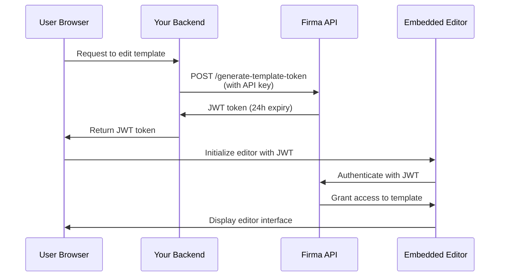

# Автентифікація API та JWT-токени

Firma API використовує два методи автентифікації: автентифікацію через API-ключ для запитів server-to-server та JWT-токени для вбудовування редакторів шаблонів і запитів на підпис у вашому застосунку.

## Автентифікація через API-ключ

Усі ендпоінти API вимагають автентифікації за допомогою API-ключа у заголовку `Authorization`.

### Як це працює

Ваш API-ключ автентифікує ваші запити та визначає, до яких ресурсів робочого простору ви маєте доступ. Кожен робочий простір має свій унікальний API-ключ, який можна отримати через ендпоінт [Get Workspace](/api-reference/v01.15.00/workspaces/get-a-workspace).

**Захищений робочий простір**: Кожен обліковий запис компанії має один захищений робочий простір, який неможливо видалити. Цей захищений робочий простір містить головний API-ключ вашого облікового запису, який має доступ до всіх ендпоінтів робочих просторів, API-ключів, компанії/облікового запису та webhook-ів. Використовуйте цей ключ для операцій на рівні всього облікового запису або коли вам потрібно керувати кількома робочими просторами.

### Тестовий режим (Live та Test-ключі)

Кожен робочий простір має **два** API-ключі: **live**-ключ і **test**-ключ. Тестовий режим визначається тим, який ключ ви надсилаєте — окремого прапорця або параметра немає.

- Запити, автентифіковані **test**-ключем, **не** споживають кредити, і будь-які створені ними запити на підпис позначаються як тестові та мають водяний знак.
- Запити, автентифіковані **live**-ключем, виконуються нормально та споживають кредити.

Обидва ключі повертаються, коли ви створюєте робочий простір (`api_key` = live, `test_api_key` = test), а також ендпоінтами [Get Workspace](/api-reference/v01.24.00/workspaces/get-a-workspace) та List Workspaces. Використовуйте test-ключ під час інтеграції, а потім переключіться на live-ключ для продакшена.

Ви можете ротувати кожен тип ключа незалежно: передайте `key_type` (`"live"` або `"test"`, за замовчуванням `"live"`) до ендпоінтів [regenerate](/api-reference/v01.24.00/workspaces/regenerate-workspace-api-key) та [expire](/api-reference/v01.24.00/workspaces/expire-pending-api-keys). Ротація одного типу не впливає на інший.

<Note>
  Test-ключі — це повноцінні облікові дані з тим самим обсягом доступу, що й live-ключі — тримайте їх на стороні сервера та ніколи не розкривайте у клієнтському коді. Єдина відмінність — це поведінка щодо білінгу та водяного знака.
</Note>

### Ротація API-ключа

Ви можете регенерувати API-ключі для незахищених робочих просторів для підвищення безпеки. Коли ви регенеруєте ключ:

1. **Новий API-ключ створюється негайно** і повертається у відповіді
2. **Старі ключі позначаються на закінчення терміну через 24 години** — вони продовжують працювати протягом цього пільгового періоду
3. **Ви можете вручну достроково анулювати старі ключі**, коли переконалися, що новий ключ працює

<Note>
  **Ключі захищеного робочого простору не можна регенерувати** через API. Це запобігає випадковому блокуванню вашого облікового запису. Зверніться до підтримки, якщо вам потрібно ротувати ключ вашого захищеного робочого простору.
</Note>

#### Регенерація API-ключа

Згенеруйте новий API-ключ для робочого простору. Старий ключ автоматично закінчить свою дію через 24 години:

```javascript
const response = await fetch(
  `https://api.firma.dev/functions/v1/signing-request-api/workspaces/${workspaceId}/api-key/regenerate`,
  {
    method: 'POST',
    headers: {
      'Authorization': process.env.FIRMA_API_KEY,
      'Content-Type': 'application/json'
    }
  }
);

const result = await response.json();
console.log('New API key:', result.new_key);
// Store the new key securely
```

**Відповідь:**

```json
{
  "message": "API key regenerated. Old keys will expire in 24 hours.",
  "workspace_id": "123e4567-e89b-12d3-a456-426614174000",
  "new_key": "firma_api_abc123xyz...",
  "expiring_keys": [
    {
      "id": "old-key-uuid",
      "expires_at": "2025-12-19T10:30:00Z"
    }
  ]
}
```

#### Дострокове анулювання старих ключів

Після перевірки, що новий ключ працює, ви можете негайно анулювати всі очікувані ключі:

```javascript
const response = await fetch(
  `https://api.firma.dev/functions/v1/signing-request-api/workspaces/${workspaceId}/api-key/expire`,
  {
    method: 'POST',
    headers: {
      'Authorization': process.env.FIRMA_API_KEY,
      'Content-Type': 'application/json'
    }
  }
);

const result = await response.json();
console.log(`Expired ${result.expired_count} key(s)`);
```

**Відповідь:**

```json
{
  "message": "Expired 1 pending API key(s)",
  "workspace_id": "123e4567-e89b-12d3-a456-426614174000",
  "expired_count": 1,
  "expired_keys": ["old-key-uuid"]
}
```

**Найкраща практика ротації ключів:**

1. Викличте ендпоінт regenerate, щоб отримати новий ключ
2. Оновіть конфігурацію вашого застосунку з новим ключем
3. Перевірте, що новий ключ працює правильно
4. Викличте ендпоінт expire, щоб негайно анулювати старі ключі
5. Спостерігайте за будь-якими помилками, що вказують на сервіси, які все ще використовують старий ключ

<Warning>
  **Ніколи не розкривайте ваш API-ключ у frontend-коді або клієнтських застосунках.** API-ключі мають використовуватися лише в захищених backend-сервісах. Завжди зберігайте їх як змінні середовища.
</Warning>

### Формат заголовка

API-ключ можна надсилати двома способами:

1. **Прямий формат** (рекомендовано для простоти):

```bash
Authorization: your-api-key-here
```

2. **Формат Bearer-токена** (необов’язково):

```bash
Authorization: Bearer your-api-key-here
```

Обидва формати приймаються. Префікс Bearer необов’язковий, але не є вимогою.

### Приклади коду

<CodeGroup>

```bash cURL
curl https://api.firma.dev/functions/v1/signing-request-api/templates \
  -H "Authorization: YOUR_API_KEY" \
  -H "Content-Type: application/json"
```


```javascript JavaScript
const response = await fetch(
  'https://api.firma.dev/functions/v1/signing-request-api/templates',
  {
    headers: {
      'Authorization': process.env.FIRMA_API_KEY,
      'Content-Type': 'application/json'
    }
  }
);

const templates = await response.json();
```


```python Python
import os
import requests

headers = {
    'Authorization': os.environ['FIRMA_API_KEY'],
    'Content-Type': 'application/json'
}

response = requests.get(
    'https://api.firma.dev/functions/v1/signing-request-api/templates',
    headers=headers
)

templates = response.json()
```

</CodeGroup>

### Помилка у відповіді

Якщо ваш API-ключ відсутній або недійсний, ви отримаєте відповідь `401 Unauthorized`:

```json
{
  "error": "Unauthorized",
  "code": "UNAUTHORIZED",
  "message": "Invalid or missing API key"
}
```

---

## JWT-токени для вбудованих функцій

Токени JWT (JSON Web Token) дозволяють вам вбудовувати редактор шаблонів Firma та редактор запитів на підпис прямо у ваш застосунок. Ці токени підписуються за допомогою RSA-256 та мають обмежений термін дії для безпеки.

### Коли використовувати JWT-токени

Використовуйте JWT-токени, коли ви хочете:

- Вбудувати редактор шаблонів у ваш застосунок, щоб користувачі створювали/редагували шаблони документів
- Вбудувати редактор запитів на підпис, щоб користувачі кастомізували документи перед надсиланням
- Забезпечити безпечний, обмежений у часі доступ до конкретних шаблонів або запитів на підпис
- Контролювати, до яких ресурсів мають доступ користувачі, не розкриваючи ваш API-ключ

<Note>
  **JWT-токени завжди мають генеруватися з вашого безпечного backend**, ніколи з frontend-коду. Ваш backend використовує API-ключ для генерації токенів, які потім передаються на frontend для ініціалізації редактора.
</Note>

### Типи JWT-токенів

| Тип токена                | Ендпоінт                                                                                                                         | Термін дії | Випадок використання                                    |
| ------------------------- | -------------------------------------------------------------------------------------------------------------------------------- | ---------- | ------------------------------------------------------- |
| **Токен шаблону**        | [Generate JWT Token for Embedding Templates](/api-reference/v01.15.00/jwt-management/generate-jwt-token-for-embedding-templates) | 24 години   | Вбудувати редактор шаблонів для створення/редагування шаблонів    |
| **Токен запиту на підпис** | [Generate JWT Token for Signing Request](/api-reference/v01.15.00/jwt-management/generate-jwt-token-for-signing-request)         | 24 години   | Вбудувати редактор запиту на підпис для кастомізації документа |

### Потік автентифікації

Ось як працює JWT-автентифікація для вбудованих функцій:



### Посібник з реалізації

#### Крок 1: Згенеруйте JWT-токен (Backend)

Згенеруйте JWT-токен з вашого безпечного backend, використовуючи ваш API-ключ:

<CodeGroup>

```javascript Node.js/Express
// Backend endpoint to generate JWT for template editing
app.post('/api/get-template-token', async (req, res) => {
  const { templateId } = req.body;

  try {
    const response = await fetch(
      'https://api.firma.dev/functions/v1/signing-request-api/generate-template-token',
      {
        method: 'POST',
        headers: {
          'Authorization': process.env.FIRMA_API_KEY,
          'Content-Type': 'application/json'
        },
        body: JSON.stringify({
          companies_workspaces_templates_id: templateId
        })
      }
    );

    const data = await response.json();
    
    // Return JWT to frontend (never expose API key)
    res.json({ 
      token: data.jwt,
      expiresAt: data.expires_at 
    });
  } catch (error) {
    res.status(500).json({ error: 'Failed to generate token' });
  }
});
```


```python Python/Flask
from flask import Flask, request, jsonify
import os
import requests

app = Flask(__name__)

@app.route('/api/get-template-token', methods=['POST'])
def get_template_token():
    template_id = request.json.get('templateId')
    
    try:
        response = requests.post(
            'https://api.firma.dev/functions/v1/signing-request-api/generate-template-token',
            headers={
                'Authorization': os.environ['FIRMA_API_KEY'],
                'Content-Type': 'application/json'
            },
            json={
                'companies_workspaces_templates_id': template_id
            }
        )
        
        data = response.json()
        
        # Return JWT to frontend (never expose API key)
        return jsonify({
            'token': data['jwt'],
            'expiresAt': data['expires_at']
        })
    except Exception as e:
        return jsonify({'error': 'Failed to generate token'}), 500
```

</CodeGroup>

**Відповідь:**

```json
{
  "jwt": "eyJhbGciOiJSUzI1NiIsInR5cCI6IkpXVCJ9...",
  "jwt_id": "a1b2c3d4-e5f6-7g8h-9i0j-k1l2m3n4o5p6",
  "expires_at": "2025-12-18T10:00:00Z",
  "template_id": "template-uuid-here"
}
```

#### Крок 2: Ініціалізуйте редактор (Frontend)

Використайте JWT-токен для ініціалізації вбудованого редактора у вашому frontend:

```html
<!DOCTYPE html>
<html>
<head>
  <title>Template Editor</title>
  <!-- Load the Firma Template Editor library -->
  <script src="https://api.firma.dev/functions/v1/embed-proxy/template-editor.js"></script>
</head>
<body>
  <div id="firma-editor-container" style="width: 100%; height: 600px;"></div>

  <script>
    async function initializeEditor(templateId) {
      // Request JWT from your backend
      const response = await fetch('/api/get-template-token', {
        method: 'POST',
        headers: { 'Content-Type': 'application/json' },
        body: JSON.stringify({ templateId })
      });

      const { token, expiresAt } = await response.json();

      // Initialize the embedded editor
      window.FirmaTemplateEditor.init({
        container: '#firma-editor-container',
        jwt: token,
        templateId: templateId,
        theme: 'light', // or 'dark'
        readOnly: false,
        onSave: (savedData) => {
          console.log('Template saved successfully:', savedData);
        },
        onError: (error) => {
          console.error('Editor error:', error);
        },
        onLoad: (template) => {
          console.log('Template loaded:', template);
        }
      });
    }

    // Initialize with your template ID
    initializeEditor('your-template-id-here');
  </script>
</body>
</html>
```

Для редактора запитів на підпис використайте ендпоінт JWT для запиту на підпис та бібліотеку редактора запитів на підпис:

```javascript
// Generate signing request token from backend
const response = await fetch('/api/get-signing-request-token', {
  method: 'POST',
  headers: { 'Content-Type': 'application/json' },
  body: JSON.stringify({ signingRequestId })
});

const { token } = await response.json();

// Load signing request editor library
// <script src="https://api.firma.dev/functions/v1/embed-proxy/signing-request-editor.js"></script>

// Initialize signing request editor
window.FirmaSigningRequestEditor.init({
  container: '#firma-signing-request-container',
  jwt: token,
  signingRequestId: signingRequestId,
  theme: 'light',
  onSave: (data) => console.log('Signing request saved:', data),
  onSend: (data) => console.log('Signing request sent:', data),
  onError: (error) => console.error('Error:', error)
});
```

#### Крок 3: Анулюйте JWT-токен (Необов’язково)

Анулюйте JWT-токен, коли він більше не потрібен:

<CodeGroup>

```javascript Node.js
const response = await fetch(
  'https://api.firma.dev/functions/v1/signing-request-api/revoke-template-token',
  {
    method: 'POST',
    headers: {
      'Authorization': process.env.FIRMA_API_KEY,
      'Content-Type': 'application/json'
    },
    body: JSON.stringify({
      jwt_id: 'a1b2c3d4-e5f6-7g8h-9i0j-k1l2m3n4o5p6'
    })
  }
);

const result = await response.json();
// { message: "JWT revoked successfully", jwt_id: "...", revoked_at: "..." }
```


```python Python
response = requests.post(
    'https://api.firma.dev/functions/v1/signing-request-api/revoke-template-token',
    headers={
        'Authorization': os.environ['FIRMA_API_KEY'],
        'Content-Type': 'application/json'
    },
    json={
        'jwt_id': 'a1b2c3d4-e5f6-7g8h-9i0j-k1l2m3n4o5p6'
    }
)

result = response.json()
```

</CodeGroup>

### Найкращі практики безпеки JWT

<Warning>
  **Контрольний список безпеки:**

  1. ✅ **Завжди генеруйте JWT з вашого backend** — Ніколи не розкривайте ваш API-ключ у frontend-коді
  2. ✅ **Використовуйте змінні середовища** — Зберігайте API-ключі безпечно, ніколи не вписуйте їх у код
  3. ✅ **Валідуйте термін дії токена** — Перевіряйте `expires_at` та оновлюйте токени за потреби
  4. ✅ **Використовуйте лише HTTPS** — Ніколи не передавайте токени через незашифровані з’єднання
  5. ✅ **Анулюйте невикористовувані токени** — Анулюйте JWT після завершення редагування або сесії
  6. ✅ **Реалізуйте оновлення токенів** — Запитуйте нові токени до закінчення терміну дії для тривалих сесій
  7. ✅ **Правильно скопуйте токени** — Кожен JWT прив’язаний до конкретного шаблону або запиту на підпис
</Warning>

---

## 

---

## Пов’язані посібники

Дізнайтеся більше про реалізацію вбудованих функцій та роботу з API:

- [Вбудований редактор шаблонів](/guides/embeddable-template-editor) — Повний посібник із вбудовування редактора шаблонів
- [Вбудований редактор запитів на підпис](/guides/embeddable-signing-request-editor) — Вбудуйте кастомізацію запитів на підпис
- [Надсилання запитів на підпис](/guides/sending-signing-request) — Надсилайте документи на підпис
- [Webhook-и](/guides/webhooks) — Підпишіться на події в реальному часі

## Довідник API

Ключові ендпоінти автентифікації та керування JWT:

**Керування API-ключами:**

- [Get Workspace](/api-reference/v01.15.00/workspaces/get-a-workspace) — Отримати API-ключ робочого простору
- [Regenerate Workspace API Key](/api-reference/v01.15.00/workspaces/regenerate-workspace-api-key) — Згенерувати новий API-ключ
- [Expire Pending API Keys](/api-reference/v01.15.00/workspaces/expire-pending-api-keys) — Негайно анулювати старі ключі

**Керування JWT-токенами:**

- [Generate JWT Token for Embedding Templates](/api-reference/v01.15.00/jwt-management/generate-jwt-token-for-embedding-templates)
- [Generate JWT Token for Signing Request](/api-reference/v01.15.00/jwt-management/generate-jwt-token-for-signing-request)
- [Revoke Template JWT Token](/api-reference/v01.15.00/jwt-management/revoke-template-jwt-token)
- [Revoke Signing Request JWT Token](/api-reference/v01.15.00/jwt-management/revoke-a-signing-request-jwt-token)

**Початок роботи:**

- [Get Company Information](/api-reference/v01.15.00/company/get-company-information)
- [Create Template](/api-reference/v01.15.00/templates/create-template)
- [Create Signing Request](/api-reference/v01.15.00/signing-requests/create-signing-request)
